Introduction
============

This files contains text mining analysis of the SPOOKY data. You should be able to put this file in the `doc` folder of your `Project 1` repository and it should just run (provided you have `multiplot.R` in the `libs` folder and `spooky.csv` in the `data` folder).

#### <u>Content Table</u>

**Part 1 Data Preparation**
1.Setup the Libraries
2.Read Data
3.Data Structure Overview
4.Data Cleaning

**Part 2 Data Exploraion**
1.Unigram
2.Bigram
3.Trigram
4.Feature Engineering
5.Sentence Generation

**Part 3 Data Prediction**
1.Logistics Regression
2.LDA Topic Modeling

Part 1 Data Preparation
=======================

1.Setup the Libraries
---------------------

First we want to install and load libraries we need along the way. Note that the following code is completely reproducible -- you don't need to add any code on your own to make it run.

``` r
packages.used <- c("ggplot2", "dplyr", "tibble", "tidyr",  "stringr", "tidytext", "topicmodels", "wordcloud", "ggridges")

# check packages that need to be installed.
packages.needed <- setdiff(packages.used, intersect(installed.packages()[,1], packages.used))

# install additional packages
if(length(packages.needed) > 0) {
  install.packages(packages.needed, dependencies = TRUE, repos = 'http://cran.us.r-project.org')
}

library(ggplot2)
library(dplyr)
library(tibble)
library(tidyr)
library(stringr)
library(tidytext)
library(topicmodels)
library(wordcloud)
library(ggridges)

source("../libs/multiplot.R")
```

2.Read Data
-----------

The following code assumes that the dataset `spooky.csv` lives in a `data` folder (and that we are inside a `docs` folder).

``` r
spooky <- read.csv('../data/spooky.csv', as.is = TRUE)
```

3.Data Structure Overview
-------------------------

Let's first remind ourselves of the structure of the data.

``` r
head(spooky)
```

    ##        id
    ## 1 id26305
    ## 2 id17569
    ## 3 id11008
    ## 4 id27763
    ## 5 id12958
    ## 6 id22965
    ##                                                                                                                                                                                                                                                                                                                                                                                                                                                                                   text
    ## 1                                                                                                                                                                                                                                              This process, however, afforded me no means of ascertaining the dimensions of my dungeon; as I might make its circuit, and return to the point whence I set out, without being aware of the fact; so perfectly uniform seemed the wall.
    ## 2                                                                                                                                                                                                                                                                                                                                                                                                              It never once occurred to me that the fumbling might be a mere mistake.
    ## 3                                                                                                                                                                                                                                                                             In his left hand was a gold snuff box, from which, as he capered down the hill, cutting all manner of fantastic steps, he took snuff incessantly with an air of the greatest possible self satisfaction.
    ## 4                                                                                                                                                                                                                                                                       How lovely is spring As we looked from Windsor Terrace on the sixteen fertile counties spread beneath, speckled by happy cottages and wealthier towns, all looked as in former years, heart cheering and fair.
    ## 5                                                                                                                                                                                                                                                                                                       Finding nothing else, not even gold, the Superintendent abandoned his attempts; but a perplexed look occasionally steals over his countenance as he sits thinking at his desk.
    ## 6 A youth passed in solitude, my best years spent under your gentle and feminine fosterage, has so refined the groundwork of my character that I cannot overcome an intense distaste to the usual brutality exercised on board ship: I have never believed it to be necessary, and when I heard of a mariner equally noted for his kindliness of heart and the respect and obedience paid to him by his crew, I felt myself peculiarly fortunate in being able to secure his services.
    ##   author
    ## 1    EAP
    ## 2    HPL
    ## 3    EAP
    ## 4    MWS
    ## 5    HPL
    ## 6    MWS

``` r
summary(spooky)
```

    ##       id                text              author         
    ##  Length:19579       Length:19579       Length:19579      
    ##  Class :character   Class :character   Class :character  
    ##  Mode  :character   Mode  :character   Mode  :character

``` r
fillColor = "#FFA07A"
fillColor2 = "#F1C40F"
```

We see from the above that each row of our data contains a unique ID, a single sentence text excerpt, and an abbreviated author name. `HPL` is Lovecraft, `MWS` is Shelly, and `EAP` is Poe. We finally note that there are no missing values, and we change author name to be a factor variable, which will help us later on.

``` r
sum(is.na(spooky))
```

    ## [1] 0

``` r
spooky$author <- as.factor(spooky$author)
```

4.Data Cleaning
---------------

We first use the `unnest_tokens()` function to drop all punctuation and transform all words into lower case. At least for now, the punctuation isn't really important to our analysis -- we want to study the words. In addition, `tidytext` contains a dictionary of stop words, like "and" or "next", that we will get rid of for our analysis, the idea being that the non-common words (...maybe the SPOOKY words) that the authors use will be more interesting. If this is new to you, here's a textbook that can help: *[Text Mining with R; A Tidy Approach](https://www.tidytextmining.com)*. It teaches the basic handling of natural language data in `R` using tools from the "tidyverse". The tidy text format is a table with one token per row, where a token is a word.

``` r
spooky_wrd <- unnest_tokens(spooky, word, text)
spooky_wrdnew <- anti_join(spooky_wrd, stop_words, by = "word")
```

Part 2 Data Exploration
=======================

1.Unigram
---------

### Word Frequency & Word Cloud

Now we study some of the most common words in the entire data set. With the below code we plot the fifty most common words in the entire datset. We see that "time", "life", and "night" all appear frequently.

``` r
#Wordcloud for the entire dataset
layout(matrix(c(1,1,1,2,3,4,5,5,5),3,3,byrow = T),heights = c(3,3,2))
par(mar = c(0,0,0,0))
words <- count(group_by(spooky_wrdnew, word))$word
freqs <- count(group_by(spooky_wrdnew, word))$n
wordcloud(words, freqs, max.words = 50, color = c("purple4", "red4", "black"))
#Wordcloud for each wuthor
#Function to generate dataset for each author
get_common_words_by_author <- function(x, author, remove.stopwords = FALSE){
  if(remove.stopwords){
    x <- x %>% dplyr::anti_join(stop_words)
  }
  
  x[x$author == author,] %>%
    dplyr::count(word, sort = TRUE)
}
words_EAP <- get_common_words_by_author(x = spooky_wrd,
                           author = "EAP",
                           remove.stopwords = TRUE)
words_HPL <- get_common_words_by_author(x = spooky_wrd,
                           author = "HPL",
                           remove.stopwords = TRUE)
words_MWS <- get_common_words_by_author(x = spooky_wrd,
                           author = "MWS",
                           remove.stopwords = TRUE)
pal <- brewer.pal(6,"Dark2")
pal1 <- pal[-(1)]
pal2 <- brewer.pal(9,"BuGn")
pal3 <- pal2[-(1:4)]
#EAP
wordcloud(words_EAP$word,words_EAP$n,max.words = 50,colors =pal)
#HPL
wordcloud(words_HPL$word,words_HPL$n,max.words = 50,colors =pal)
#MWS
wordcloud(words_MWS$word,words_MWS$n,max.words = 50,colors =pal)
#Title
plot.new()
text(x=0, y=1, c("                                                             EAP","                                                                                                                                                                                                                               HPL ","                                                                                                                                                                                                                                                                                                                                                                                 MWS"))
```

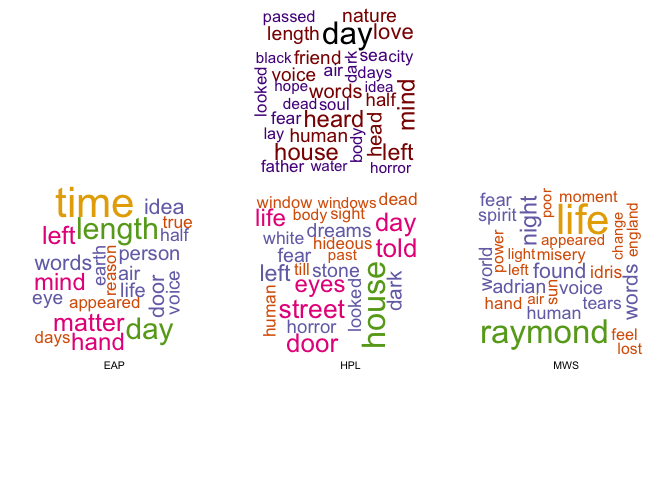

I also plotted wordcloud for each author to compare their difference in word using. Compared to the overall word frequency,
\* **EAP used words "length","head","left","matter"** (EAP focused more on part of human? Has more word description about human's organ? like "haed","eye","feet","body","hand")
\* **HPL used words "house","heard","strange","street","told","door"** (seems like HPL has more scenary description and created a backgroud place for the horrible story)
\* **MWS used words "love","heart","raymond","death","father","mind"** (MWS used more inner feeling and more abstract word like "spirit","hope"...)
more often.

### TF-IDF

Too many arcane words in this section..... I have a hard time searching its meaning as an international student,Still Couldn't Understand what they want to convey....

TF stands for term frequency or how often a word appears in a text and it is what is studied above in the word cloud. IDF stands for inverse document frequncy, and it is a way to pay more attention to words that are rare within the entire set of text data that is more sophisticated than simply removing stop words. Multiplying these two values together calculates a term's tf-idf, which is the frequency of a term adjusted for how rarely it is used. We'll use tf-idf as a heuristic index to indicate how frequently a certain author uses a word relative to the frequency that ll the authors use the word. Therefore we will find words that are characteristic for a specific author, a good thing to have if we are interested in solving the author identification problem.

``` r
frequency <- count(spooky_wrdnew, author, word)
tf_idf    <- bind_tf_idf(frequency, word, author, n)

tf_idf <- arrange(tf_idf, desc(tf_idf))
tf_idf <- mutate(tf_idf, word = factor(word, levels = rev(unique(word))))
tf_idf_30 <- top_n(tf_idf, 30, tf_idf)

ggplot(tf_idf_30) +
  geom_col(aes(word, tf_idf, fill = author)) +
  labs(x = NULL, y = "TF-IDF values") +
  theme(legend.position = "top", axis.text.x  = element_text(angle=45, hjust=1, vjust=0.9))
```

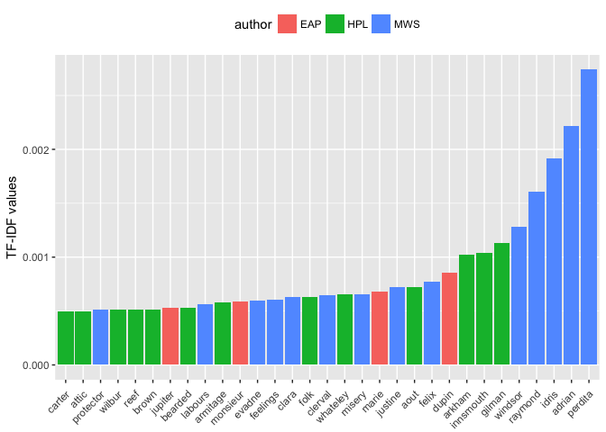

Note that in the above, many of the words recognized by their tf-idf scores are names. This makes sense -- if we see text referencing Raymond, Idris, or Perdita, we know almost for sure that MWS is the author. But some non-names stand out. EAP often uses "monsieur" and "jupiter" while HPL uses the words "bearded" and "attic" more frequently than the others. We can also look at the most characteristic terms per author.

``` r
tf_idf <- ungroup(top_n(group_by(tf_idf, author), 20, tf_idf))
  
ggplot(tf_idf) +
  geom_col(aes(word, tf_idf, fill = author)) +
  labs(x = NULL, y = "tf-idf") +
  theme(legend.position = "none") +
  facet_wrap(~ author, ncol = 3, scales = "free") +
  coord_flip() +
  labs(y = "TF-IDF values")
```

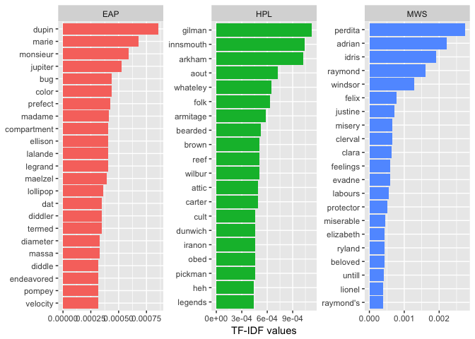

2.Bigrams
---------

### TF-IDF

Let's start with those bigrams. We can extract all of those pairs in a very similar way as the individual words using our magical *tidytext* scissors. Here are a few random examples that will change every time we run this part:

``` r
t2 <- spooky %>% select(author, text) %>% unnest_tokens(bigram, text, token = "ngrams", n = 2)
sample_n(t2, 5)
```

    ##        author            bigram
    ## 484177    MWS      free country
    ## 206051    HPL assiduousness and
    ## 420312    MWS         enough it
    ## 279904    HPL            all of
    ## 397032    MWS         above all

In order to filter out the stop words we need to *separate* the bigrams first, and then later *unite* them back together after the filtering. *Separate/unite* are also the names of the corresponding *dplyr* functions:

``` r
bi_sep <- t2 %>%
  separate(bigram, c("word1", "word2"), sep = " ")

bi_filt <- bi_sep %>%
  filter(!word1 %in% stop_words$word) %>%
  filter(!word2 %in% stop_words$word)

# for later
bigram_counts <- bi_filt %>%
  count(word1, word2, sort = TRUE)

t2 <- bi_filt %>%
  unite(bigram, word1, word2, sep = " ")
```

Now we can extract the TF-IDF values.

``` r
t2_tf_idf <- t2 %>%
  count(author, bigram) %>%
  bind_tf_idf(bigram, author, n) %>%
  arrange(desc(tf_idf))
```

And then we plot the bigrams with the highest TF-IDF values per *author* and we see that ...

``` r
t2_tf_idf %>%
  arrange(desc(tf_idf)) %>%
  mutate(bigram = factor(bigram, levels = rev(unique(bigram)))) %>%
  group_by(author) %>%
  top_n(10, tf_idf) %>%
  ungroup() %>%  
  ggplot(aes(bigram, tf_idf, fill = author)) +
  geom_col() +
  labs(x = NULL, y = "TF-IDF values") +
  theme(legend.position = "none") +
  facet_wrap(~ author, ncol = 3, scales = "free") +
  coord_flip()
```

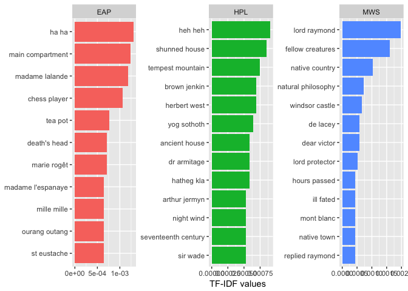

Um... I have the indistinct feeling that both Poe and Lovecraft are laughing at us. If there is only one thing in the world that should make you feel uneasy, it's probably laughter from those two.

We also find:

-   Besides cruel humour, for Poe it's all about "chess players" and "tea pots". We've also got a few more names and, apparently, a fair share of "Orang Utan" appearances.

-   Lovecraft sets the scence with "ancient houses" and "shunned houses" during the "seventeenth century". Also he has a couple of characteristic character names.

-   So has Mary Shelly, who seems to really like "Lord Raymond". Well, everybody loves Raymond, don't they? We also find a few turns of phrase that are typical for her, such as "fellow creatures", "hours passed", or "ill fated". *Let's hope that the latter is not an omen for our own expedition into the heart of the darkness ...*

### First Two Words(Will be used for sentence generation)

``` r
spooky$first_two<-word(spooky$text, 1,2, sep=" ")
spooky_first_two<-spooky%>%
  count(author,first_two)%>%
  arrange(desc(n,author))

spooky_first_two1 <- ungroup(top_n(group_by(spooky_first_two, author), 20, n))

#layout(matrix(c(1,2),2,1,byrow = T),heights = c(2,3))
#par(mar = c(0,0,0,0))
#par(mfrow=c(2,1))
p1<-spooky_first_two1 %>%
  ggplot(aes(reorder(first_two,n), n, fill = author), position = position_stack(reverse = TRUE)) +
  geom_col() +
  labs(x = NULL, y = "Number of Appearance") +
  theme(legend.position = "none",axis.text.x  = element_text(angle=45, hjust=1, vjust=0.9)) 

p2<-spooky_first_two1 %>%
  ggplot(aes(reorder(first_two,n), n, fill = author), position = position_stack(reverse = TRUE)) +
  geom_col() +
  labs(x = NULL, y = "Number of Appearance") +
  theme(legend.position = "none")+
  facet_wrap(~ author, ncol = 3, scales = "free") +
  coord_flip()

layout <- matrix(c(1, 2), 2, 1, byrow = TRUE)
multiplot(p1, p2, layout = layout)
```

    ## Loading required package: grid

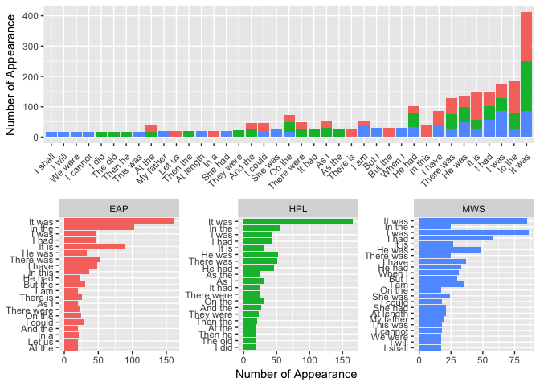

3.Trigrams
----------

### Without Stopwords

*Three is a magical number. A terrible number. There were 3 witches to foretell Macbeth his blood-drenched destiny. The devil hound Cerberus has 3 heads. The number of the beast is 3 times the number 3+3. All these warning signs try to reach our concience as we prepare to repeat the same analysis we had done for bigrams on their cousins thrice removed: trigrams.*

*Blind for knowledge, yielding to the call of power just like the sorcerer's apprentice, we continue our study. We crave to know more. A little spark of reason and self-preservation is trying to make itself heard against the raging thirst in our brains, but it burns ever weaker as the candle, is it still a candle?, shines brighter and brighter.*

Extracting trigrams follows the same procedure as for bigrams. Again we filter out stop words and include a few random examples:

``` r
t3 <- spooky %>% select(author, text) %>% unnest_tokens(trigram, text, token = "ngrams", n = 3)

tri_sep <- t3 %>%
  separate(trigram, c("word1", "word2", "word3"), sep = " ")

tri_filt <- tri_sep %>%
  filter(!word1 %in% stop_words$word) %>%
  filter(!word2 %in% stop_words$word) %>%
  filter(!word3 %in% stop_words$word)

# for later
trigram_counts <- tri_filt %>%
  count(word1, word2, word3, sort = TRUE)

t3 <- tri_filt %>%
  unite(trigram, word1, word2, word3, sep = " ")

sample_n(t3, 5)
```

    ##       author                     trigram
    ## 5659     HPL occurred ibid's masterpiece
    ## 8435     HPL             half frozen sod
    ## 10200    HPL    furius camillus aurelius
    ## 4383     HPL         life forever closed
    ## 3862     EAP    mille decollavimus mille

And here is the corresponding TF-IDF plot for the most characteristic terms:

``` r
t3_tf_idf <- t3 %>%
  count(author, trigram) %>%
  bind_tf_idf(trigram, author, n) %>%
  arrange(desc(tf_idf))

t3_tf_idf %>%
  arrange(desc(tf_idf)) %>%
  mutate(trigram = factor(trigram, levels = rev(unique(trigram)))) %>%
  group_by(author) %>%
  top_n(5, tf_idf) %>%
  ungroup() %>%  
  ggplot(aes(trigram, tf_idf, fill = author)) +
  geom_col() +
  labs(x = NULL, y = "TF-IDF values") +
  theme(legend.position = "none") +
  facet_wrap(~ author, ncol = 3, scales = "free") +
  coord_flip()
```

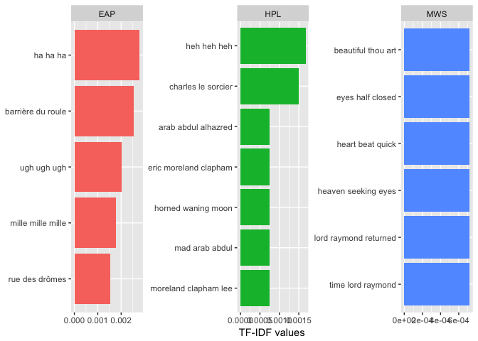

We find:

-   More scary laughter and characteristic names from Poe and Lovecraft. Feel free to admit that you also read "Eric Moreland Clap**ton**" at first glance in HPL's list. I like the imagery of a "horned waning moon".

-   Curiously, Mary Shelley does not seem to have particularly typical phrases she repeats more often than others. The ones she does use suggest a penchant for body language, especially the eyes.

-   Most importantly, though, we find out that Raymond was from [Galifrey](https://en.wikipedia.org/wiki/Time_Lord). That might explain why he's so popular and why he manages to exert such a strong influence on Shelley's writing.

### With Stopwords

``` r
# for later
trigram_counts2 <- tri_sep %>%
  count(word1, word2, word3, sort = TRUE)

t31 <- tri_sep %>%
  unite(trigram, word1, word2, word3, sep = " ")

t3_tf_idf1 <- t31 %>%
  count(author, trigram) %>%
  bind_tf_idf(trigram, author, n) %>%
  arrange(desc(tf_idf))

t3_tf_idf1 %>%
  arrange(desc(tf_idf)) %>%
  mutate(trigram = factor(trigram, levels = rev(unique(trigram)))) %>%
  group_by(author) %>%
  top_n(5, tf_idf) %>%
  ungroup() %>%  
  ggplot(aes(trigram, tf_idf, fill = author)) +
  geom_col() +
  labs(x = NULL, y = "TF-IDF values") +
  theme(legend.position = "none") +
  facet_wrap(~ author, ncol = 3, scales = "free") +
  coord_flip()+ 
  scale_fill_brewer(palette = 'Accent')
```

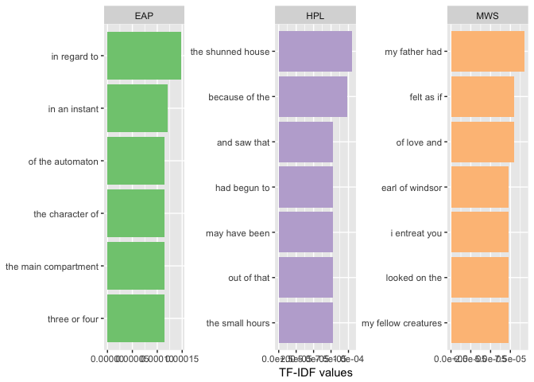

4.Feature Engineering
---------------------

We'll do some simple numerical summaries of the data to provide some nice visualizations.Here we add some Features to both the `spooky` datasets. The fatures are

-   Number of commas, semicolons, colons, questions

-   Number of blanks,others

-   Number of words beginning with Capitals, words with Capitals

-   Number of words,stopwords,negation words

-   Sentence length(characters); Word length(characters)

**Negation Words**:
Different from negative words in sentiment analysis,including:
**Negative words**: no,not,none,no one,nobody,nothing,neither,nowhere,never
**Negative Adverbs**: hardly,scarcely,barely
**Negative verbs**: doesn’t,isn’t,wasn’t,shouldn’t,wouldn’t,couldn’t,won’t,can’t,don’t
**Others**: little,few,nor,neither...nor,without,unless,but for,but that,in the absence of,regardless of,instead of,exclusive of,short of,rather than,anything but,any more than,would no more...than

Some these features have been borrowed from Kaggler *jayjay* 's kernel found [here](https://www.kaggle.com/jayjay75/text2vec-glmnet). Great work jayjay!

``` r
createFE = function(ds)
{
  ds = ds %>%
  mutate(Ncommas = str_count(ds$text, ",")) %>%
  mutate(Nsemicolumns = str_count(ds$text, ";")) %>%
  mutate(Ncolons = str_count(ds$text, ":")) %>%
  mutate(Nblank = str_count(ds$text, " ")) %>%
  mutate(Nother = str_count(ds$text, "[\\.\\.]")) %>%
  mutate(Ncapitalfirst = str_count(ds$text, " [A-Z][a-z]")) %>%
  mutate(Ncapital = str_count(ds$text, "[A-Z]")) %>%
  mutate(Nquestion = str_count(ds$text,"\\?")) 

  return(ds)
}
spooky_feature = createFE(spooky)
```

### Sentence Ingredients

``` r
# Number of Capital
spooky_feature %>%
  group_by(author) %>%
  summarise(SumCapital = sum(Ncapital,na.rm = TRUE)) %>%
  ungroup() %>%
  mutate(author = reorder(author,SumCapital)) %>%
  
  ggplot(aes(x = author,y = SumCapital)) +
  geom_bar(stat='identity',colour="white", fill = fillColor) +
  geom_text(aes(x = author, y = 1, label = paste0("(",SumCapital,")",sep="")),
            hjust=0, vjust=.5, size = 4, colour = 'black',
            fontface = 'bold') +
  labs(x = 'author', 
       y = 'Capital Letters', 
       title = 'Total Number of  Capital Letters') +
  coord_flip() + 
  theme_bw()
```

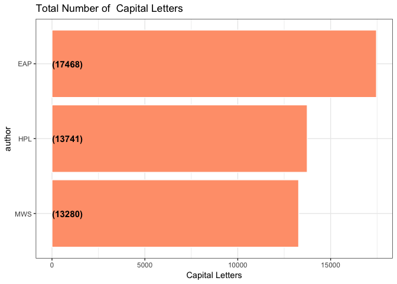

``` r
#Number of words in a sentence
spooky_feature$Nwords <- sapply(gregexpr("\\W+", spooky_feature$text), length) + 1

ggplot(spooky_feature) + 
  geom_boxplot(aes(x=author, y=Nwords,fill=author))
```

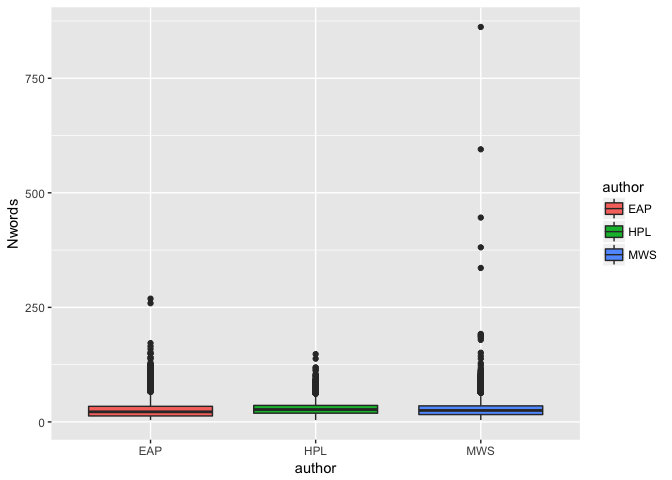

``` r
ggplot(spooky_feature) +
      geom_density_ridges(aes(Nwords, author, fill = author)) +
      scale_x_log10() +
      theme(legend.position = "none") +
      labs(x = "Number of Words")
```

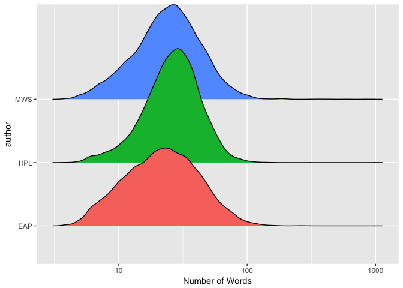

``` r
#Number of stopwords in a sentence
nostopword<-as.data.frame(table(spooky_wrdnew$id))
names(nostopword)<-c("id","num_of_nostop_wrd")
spooky_feature<-merge(spooky_feature,nostopword,by="id",all=T)
spooky_feature$num_of_nostop_wrd[is.na(spooky_feature$num_of_nostop_wrd)]<-0
spooky_feature$Nstop<-spooky_feature$Nwords - spooky_feature$num_of_nostop_wrd

ggplot(spooky_feature) + 
  geom_violin(aes(x=author, y=Nstop,fill=author))
```

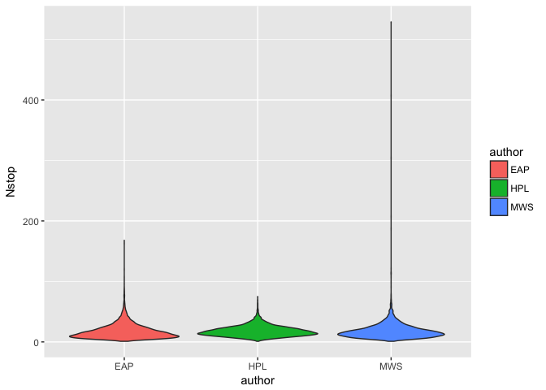

``` r
ggplot(spooky_feature) +
      geom_density_ridges(aes(Nstop, author, fill = author)) +
      scale_x_log10() +
      theme(legend.position = "none") +
      labs(x = "Number of StopWords")
```

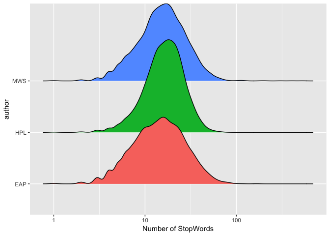

``` r
#Number of negation words in a sentence
negation<-c("no","not","none","nobody","nothing","neither","nowhere","never","hardly","scarcely","barely","doesn't","isn't","wasn't","shouldn't","wouldn't","didn't","won't","can't","little","few","nor","neither","without","unless","wa'n't","dun't","dxn't","aren't","hasn't","couldn't","hadn't","don't","mustn't","ain't","haven't","wudn't","weren't")
spooky_wrd$negation <- spooky_wrd$word %in% negation
negationwrd<-as.data.frame(table(spooky_wrd$id[spooky_wrd$negation==T] ))
names(negationwrd)<-c("id","num_of_negation_wrd")
spooky_feature<-merge(spooky_feature,negationwrd,by="id",all=T)
spooky_feature$num_of_negation_wrd[is.na(spooky_feature$num_of_negation_wrd)]<-0

ggplot(spooky_feature) + 
  geom_boxplot(aes(x=author, y=num_of_negation_wrd,fill=author))
```

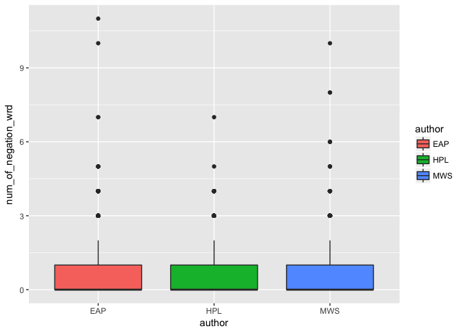

``` r
ggplot(spooky_feature) +
      geom_density_ridges(aes(num_of_negation_wrd, author, fill = author)) +
      theme(legend.position = "none") +
      labs(x = "Number of Negation Words")
```

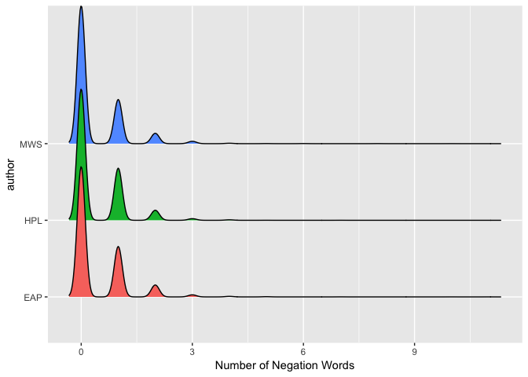

### Sentence Seasoning(Punctuations)

The bar plot shows the authors with the Total Number of Commas,SemiColons,Colons,Questions used by them.

``` r
p1<-spooky_feature %>%
  group_by(author) %>%
  summarise(SumCommas = sum(Ncommas,na.rm = TRUE)) %>%
  ungroup() %>%
  mutate(author = reorder(author,SumCommas)) %>%
  
  ggplot(aes(x = author,y = SumCommas)) +
  geom_bar(stat='identity',colour="white", fill = fillColor2) +
  geom_text(aes(x = author, y = 1, label = paste0("(",SumCommas,")",sep="")),
            hjust=0, vjust=.5, size = 4, colour = 'black',
            fontface = 'bold') +
  labs(x = 'author', 
       y = 'Commas', 
       title = 'Total Number of Commas') +
  coord_flip() + 
  theme_bw()


p2<-spooky_feature %>%
  group_by(author) %>%
  summarise(SumSemiColons = sum(Nsemicolumns,na.rm = TRUE)) %>%
  ungroup() %>%
  mutate(author = reorder(author,SumSemiColons)) %>%
  
  ggplot(aes(x = author,y = SumSemiColons)) +
  geom_bar(stat='identity',colour="white", fill = fillColor) +
  geom_text(aes(x = author, y = 1, label = paste0("(",SumSemiColons,")",sep="")),
            hjust=0, vjust=.5, size = 4, colour = 'black',
            fontface = 'bold') +
  labs(x = 'author', 
       y = 'SemiColons', 
       title = 'Total Number of SemiColons') +
  coord_flip() + 
  theme_bw()

p3<-spooky_feature %>%
  group_by(author) %>%
  summarise(SumColons = sum(Ncolons,na.rm = TRUE)) %>%
  ungroup() %>%
  mutate(author = reorder(author,SumColons)) %>%
  
  ggplot(aes(x = author,y = SumColons)) +
  geom_bar(stat='identity',colour="white", fill = fillColor2) +
  geom_text(aes(x = author, y = 1, label = paste0("(",SumColons,")",sep="")),
            hjust=0, vjust=.5, size = 4, colour = 'black',
            fontface = 'bold') +
  labs(x = 'author', 
       y = 'Colons', 
       title = 'Total Number of Colons') +
  coord_flip() + 
  theme_bw()

p4<-spooky_feature %>%
  group_by(author) %>%
  summarise(SumQuestions = sum(Nquestion,na.rm = TRUE)) %>%
  ungroup() %>%
  mutate(author = reorder(author,SumQuestions)) %>%
  
  ggplot(aes(x = author,y = SumQuestions)) +
  geom_bar(stat='identity',colour="white", fill = fillColor) +
  geom_text(aes(x = author, y = 1, label = paste0("(",SumQuestions,")",sep="")),
            hjust=0, vjust=.5, size = 4, colour = 'black',
            fontface = 'bold') +
  labs(x = 'author', 
       y = 'Questions', 
       title = 'Total Number of Questions') +
  coord_flip() + 
  theme_bw()

layout <- matrix(c(1, 2, 3, 4), 2, 2, byrow = TRUE)
multiplot(p1, p2, p3,p4, layout = layout)
```

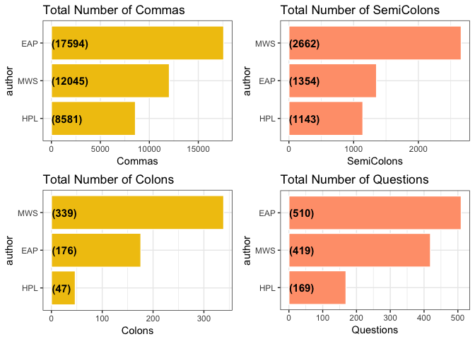

``` r
## Be careful because EAP appeared more ofen than others(there are more EAP sentenes)
```

### Sentence Structure

``` r
#Number of Recordings for Author
p5 <- ggplot(spooky) +
  geom_bar(aes(author, fill = author)) + 
  theme(legend.position = "none")

#Sentence Length(Characters)
spooky$sen_length <- str_length(spooky$text) 
#head(spooky$sen_length)
p6 <- ggplot(spooky) +
      geom_density_ridges(aes(sen_length, author, fill = author)) +
      scale_x_log10() +
      theme(legend.position = "none") +
      labs(x = "Sentence length [# characters]")

#Word Length(Characters)
spooky_wrdnew$word_length <- str_length(spooky_wrdnew$word)
#head(spooky_wrd$word_length)
p7 <- ggplot(spooky_wrdnew) +
      geom_density(aes(word_length, fill = author), bw = 0.05, alpha = 0.3) +
      scale_x_log10() +
      theme(legend.position = "none") +
      labs(x = "Word length [# characters]")

layout <- matrix(c(1, 2, 1, 3), 2, 2, byrow = TRUE)
multiplot(p5, p6, p7, layout = layout)
```

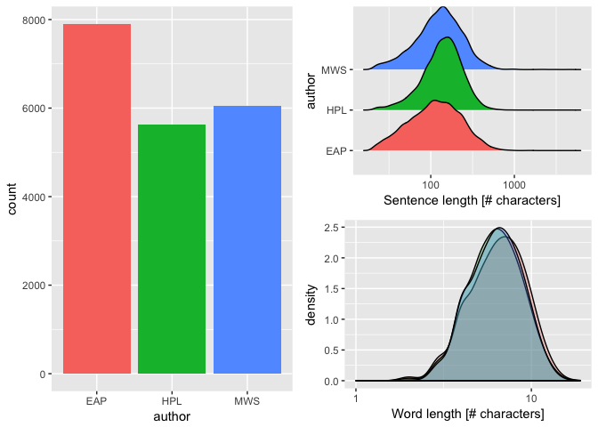

5.Sentence Generation
---------------------

``` r
##trigram of authors
trigrams_EAP <- spooky %>%
        filter(author == "EAP") %>%
        unnest_tokens(trigram, text, token = "ngrams",to_lower = TRUE, n= 3) %>%
        separate(trigram, c("word1", "word2", "word3"), sep = " ") %>%
        count(word1, word2,word3, sort = TRUE)
trigrams_HPL <- spooky %>%
        filter(author == "HPL") %>%
        unnest_tokens(trigram, text, token = "ngrams",to_lower = TRUE, n= 3) %>%
        separate(trigram, c("word1", "word2", "word3"), sep = " ") %>%
        count(word1, word2,word3, sort = TRUE)
trigrams_MWS <- spooky %>%
        filter(author == "MWS") %>%
        unnest_tokens(trigram, text, token = "ngrams",to_lower = TRUE, n= 3) %>%
        separate(trigram, c("word1", "word2", "word3"), sep = " ") %>%
        count(word1, word2,word3, sort = TRUE)

##may be a grap here about 

##sentence generator
return_third_word <- function( woord1, woord2,authordata){
        woord <- authordata %>%
                filter_(~word1 == woord1, ~word2 == woord2) %>%
                sample_n(1, weight = n) %>%
                .[["word3"]]
        if(length(woord) == 0){
                bleh <- filter_(authordata, ~word1 == woord2) %>%
                        sample_n(1, weight = n)
                warning("no word found, adding ", bleh, "to", woord1 , woord2)
                woord <- bleh
        }
        woord
}
generate_sentence <- function(word1, word2,authordata, sentencelength =5, debug =FALSE){
        #input validation
        if(sentencelength <3)stop("I need more to work with")
        sentencelength <- sentencelength -2
        # starting
        sentence <- c(word1, word2)
        woord1 <- word1
        woord2 <- word2
        for(i in seq_len(sentencelength)){
                if(debug == TRUE)print(i)
                word <- return_third_word( woord1, woord2, authordata )
                sentence <- c(sentence, word)
                woord1 <- woord2
                woord2 <- word
        }
        output <-paste(sentence, collapse = " ")
        output
}
#generate_sentence("the", "man",trigrams_EAP, 15)
#generate_sentence("the", "man",trigrams_HPL, 15)
#generate_sentence("the", "man",trigrams_MWS, 15)

## find the first two world used most frequently by author.
## compile their psycho profile starting with their sanguan life world man value
```

Part 3 Data Prediction
======================

1.Logistics Regression
----------------------

2.LDA Topic Modeling
--------------------
