Introduction
============

This files contains text mining analysis of the SPOOKY data. You should be able to put this file in the `doc` folder of your `Project 1` repository and it should just run (provided you have `multiplot.R` in the `libs` folder and `spooky.csv` in the `data` folder).

**You need to download "corrplot" & "nnet" packages to run the code for part 4.**

#### <u>Content Table</u>

**Part 1 Data Preparation**

1.  Setup the Libraries

2.  Read Data

3.  Data Structure Overview

4.  Data Cleaning

**Part 2 Data Exploraion**

1.  Unigram

-   Word Frequency & Word Cloud

-   TF-IDF

1.  Bigram

-   TF-IDF

-   First Two Words(Will be used for sentence generation)

1.  Trigram

-   Without Stopwords

-   With Stopwords

1.  Feature Engineering

-   Sentence Ingredients

-   Sentence Seasoning(Punctuations)

1.  Sentence Generation

**Part 3 Sentiment Analysis**

1.  Word Level

2.  Sentence Level

**Part 4 Data Prediction**

1.  Multinomial Logistics Regression

2.  Binary Logistics Regression

**Part 5 Topic Modeling**

Part 1 Data Preparation
=======================

1. Setup the Libraries
----------------------

First we want to install and load libraries we need along the way. Note that the following code is completely reproducible -- you don't need to add any code on your own to make it run.

**You need to download "corrplot" & "nnet" packages to run the code for part 4.**

``` r
packages.used <- c("ggplot2", "dplyr", "tibble", "tidyr",  "stringr", "tidytext", "topicmodels", "wordcloud", "ggridges")

# check packages that need to be installed.
packages.needed <- setdiff(packages.used, intersect(installed.packages()[,1], packages.used))

# install additional packages
if(length(packages.needed) > 0) {
  install.packages(packages.needed, dependencies = TRUE, repos = 'http://cran.us.r-project.org')
}

library(ggplot2)
library(dplyr)
library(tibble)
library(tidyr)
library(stringr)
library(tidytext)
library(topicmodels)
library(wordcloud)
library(ggridges)

source("../libs/multiplot.R")
```

2. Read Data
------------

The following code assumes that the dataset `spooky.csv` lives in a `data` folder (and that we are inside a `docs` folder).

``` r
spooky <- read.csv('../data/spooky.csv', as.is = TRUE)
```

3. Data Structure Overview
--------------------------

Let's first remind ourselves of the structure of the data.

``` r
head(spooky)
```

    ##        id
    ## 1 id26305
    ## 2 id17569
    ## 3 id11008
    ## 4 id27763
    ## 5 id12958
    ## 6 id22965
    ##                                                                                                                                                                                                                                                                                                                                                                                                                                                                                   text
    ## 1                                                                                                                                                                                                                                              This process, however, afforded me no means of ascertaining the dimensions of my dungeon; as I might make its circuit, and return to the point whence I set out, without being aware of the fact; so perfectly uniform seemed the wall.
    ## 2                                                                                                                                                                                                                                                                                                                                                                                                              It never once occurred to me that the fumbling might be a mere mistake.
    ## 3                                                                                                                                                                                                                                                                             In his left hand was a gold snuff box, from which, as he capered down the hill, cutting all manner of fantastic steps, he took snuff incessantly with an air of the greatest possible self satisfaction.
    ## 4                                                                                                                                                                                                                                                                       How lovely is spring As we looked from Windsor Terrace on the sixteen fertile counties spread beneath, speckled by happy cottages and wealthier towns, all looked as in former years, heart cheering and fair.
    ## 5                                                                                                                                                                                                                                                                                                       Finding nothing else, not even gold, the Superintendent abandoned his attempts; but a perplexed look occasionally steals over his countenance as he sits thinking at his desk.
    ## 6 A youth passed in solitude, my best years spent under your gentle and feminine fosterage, has so refined the groundwork of my character that I cannot overcome an intense distaste to the usual brutality exercised on board ship: I have never believed it to be necessary, and when I heard of a mariner equally noted for his kindliness of heart and the respect and obedience paid to him by his crew, I felt myself peculiarly fortunate in being able to secure his services.
    ##   author
    ## 1    EAP
    ## 2    HPL
    ## 3    EAP
    ## 4    MWS
    ## 5    HPL
    ## 6    MWS

``` r
summary(spooky)
```

    ##       id                text              author         
    ##  Length:19579       Length:19579       Length:19579      
    ##  Class :character   Class :character   Class :character  
    ##  Mode  :character   Mode  :character   Mode  :character

``` r
fillColor = "#FFA07A"
fillColor2 = "#F1C40F"
```

We see from the above that each row of our data contains a unique ID, a single sentence text excerpt, and an abbreviated author name. `HPL` is Lovecraft, `MWS` is Shelly, and `EAP` is Poe. We finally note that there are no missing values, and we change author name to be a factor variable, which will help us later on.

``` r
sum(is.na(spooky))
```

    ## [1] 0

``` r
spooky$author <- as.factor(spooky$author)
```

4. Data Cleaning
----------------

We first use the `unnest_tokens()` function to drop all punctuation and transform all words into lower case. At least for now, the punctuation isn't really important to our analysis -- we want to study the words. In addition, `tidytext` contains a dictionary of stop words, like "and" or "next", that we will get rid of for our analysis, the idea being that the non-common words (...maybe the SPOOKY words) that the authors use will be more interesting. If this is new to you, here's a textbook that can help: *[Text Mining with R; A Tidy Approach](https://www.tidytextmining.com)*. It teaches the basic handling of natural language data in `R` using tools from the "tidyverse". The tidy text format is a table with one token per row, where a token is a word.

``` r
spooky_wrd <- unnest_tokens(spooky, word, text)
spooky_wrdnew <- anti_join(spooky_wrd, stop_words, by = "word")
```

Part 2 Data Exploration
=======================

1. Unigram
----------

### 1.1 Word Frequency & Word Cloud

Now we study some of the most common words in the entire data set. With the Tutourial in class, we see that "time", "life", and "night" all appear frequently.

Then, I also plotted wordcloud for each author to compare their differences in word using.

``` r
#Wordcloud for each wuthor
#Function to generate dataset for each author
get_common_words_by_author <- function(x, author, remove.stopwords = FALSE){
  if(remove.stopwords){
    x <- x %>% dplyr::anti_join(stop_words)
  }
  
  x[x$author == author,] %>%
    dplyr::count(word, sort = TRUE)
}
words_EAP <- get_common_words_by_author(x = spooky_wrd,
                           author = "EAP",
                           remove.stopwords = TRUE)
words_HPL <- get_common_words_by_author(x = spooky_wrd,
                           author = "HPL",
                           remove.stopwords = TRUE)
words_MWS <- get_common_words_by_author(x = spooky_wrd,
                           author = "MWS",
                           remove.stopwords = TRUE)
pal <- brewer.pal(6,"Dark2")
layout(matrix(c(1,2,3),1,3,byrow = T))
par(mar = c(0,0,0,0))
#EAP
wordcloud(words_EAP$word,words_EAP$n,max.words = 50,colors =pal)
#HPL
wordcloud(words_HPL$word,words_HPL$n,max.words = 50,colors =pal)
#MWS
wordcloud(words_MWS$word,words_MWS$n,max.words = 50,colors =pal)
```

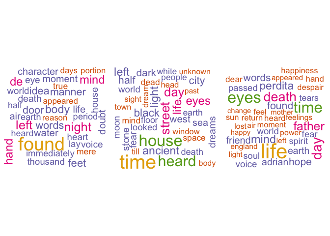

Compared to the overall word frequency,

-   EAP used words "length","head","left","matter" (EAP focused more on part of human? Has more word description about human's organ? like "haed","eye","feet","body","hand")

-   HPL used words "house","heard","strange","street","told","door" (seems like HPL has more scenary description and created a backgroud place for the horrible story)

-   MWS used words "love","heart","raymond","death","father","mind" (MWS used more inner feeling and more abstract word like "spirit","hope"...)

### 1.2 TF-IDF

TF stands for term frequency or how often a word appears in a text and it is what is studied above in the word cloud. IDF stands for inverse document frequncy, and it is a way to pay more attention to words that are rare within the entire set of text data that is more sophisticated than simply removing stop words. Multiplying these two values together calculates a term's tf-idf, which is the frequency of a term adjusted for how rarely it is used. We'll use tf-idf as a heuristic index to indicate how frequently a certain author uses a word relative to the frequency that ll the authors use the word. Therefore we will find words that are characteristic for a specific author, a good thing to have if we are interested in solving the author identification problem.

``` r
frequency <- count(spooky_wrdnew, author, word)
tf_idf    <- bind_tf_idf(frequency, word, author, n)

tf_idf <- arrange(tf_idf, desc(tf_idf))
tf_idf <- mutate(tf_idf, word = factor(word, levels = rev(unique(word))))
tf_idf_30 <- top_n(tf_idf, 30, tf_idf)

ggplot(tf_idf_30) +
  geom_col(aes(word, tf_idf, fill = author)) +
  labs(x = NULL, y = "Unigram TF-IDF Values") +
  theme(legend.position = "top", axis.text.x  = element_text(angle=45, hjust=1, vjust=0.9))+ 
  scale_fill_manual(values = c("#689420", "#FFCC66",fillColor))
```

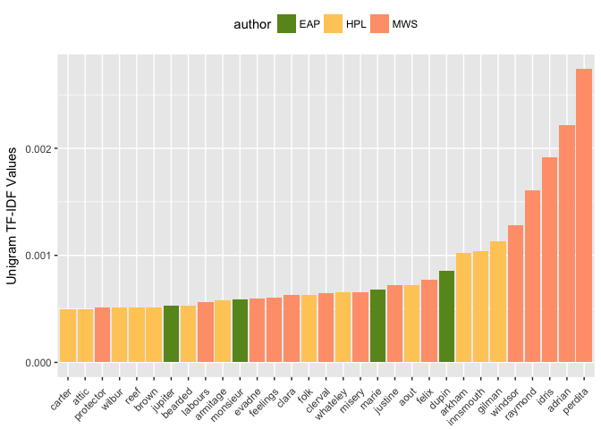

Note that in the above, many of the words recognized by their tf-idf scores are names. This makes sense -- if we see text referencing Raymond, Idris, or Perdita, we know almost for sure that MWS is the author. But some non-names stand out. EAP often uses "monsieur" and "jupiter" while HPL uses the words "bearded" and "attic" more frequently than the others.

We can also look at the most characteristic terms per author.

``` r
tf_idf <- ungroup(top_n(group_by(tf_idf, author), 20, tf_idf))
  
ggplot(tf_idf) +
  geom_col(aes(word, tf_idf, fill = author)) +
  labs(x = NULL, y = "tf-idf") +
  theme(legend.position = "none") +
  facet_wrap(~ author, ncol = 3, scales = "free") +
  coord_flip() +
  labs(y = "Unigram TF-IDF Values")+ 
  scale_fill_manual(values = c("#689420", "#FFCC66",fillColor))
```

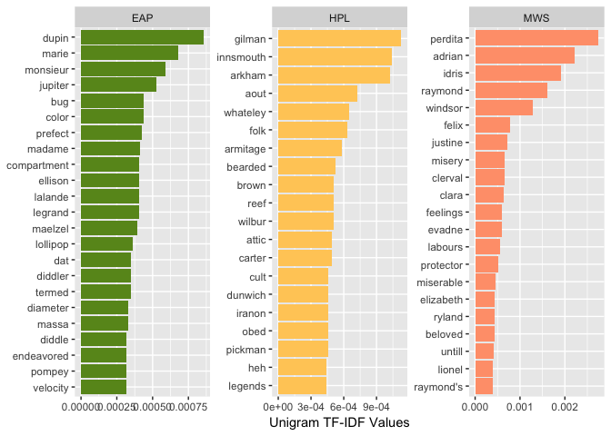

-   Naturally, we recover our top ranking words such as “Perdita” or “Arkham”. But here we also see that Mary Shelley liked the word “until” while H P Lovecraft wrote about “legends”.

-   Edgar Allan Poe’s work contains some interesting technical terms such as “diameter” or “velocity”. And “lollipop”, which is, admittedly, somewhat less scary than expected. Unless it is a lollipop made from … blood!

Too many arcane words in this section... I have a hard time searching their meanings, Still Couldn't Understand what they want to convey without context...Maybe in next parts it will reveal more interesting facts.

2. Bigrams
----------

### 2.1 TF-IDF

Let's start with those bigrams. We can extract all of those pairs in a very similar way as the individual words using our magical *tidytext* scissors. Here are a few random examples that will change every time we run this part:

``` r
t2 <- spooky %>% select(author, text) %>% unnest_tokens(bigram, text, token = "ngrams", n = 2)
sample_n(t2, 5)
```

    ##        author          bigram
    ## 131497    EAP  near neighbors
    ## 320621    HPL      that pawed
    ## 468567    MWS         that he
    ## 254912    HPL travellers have
    ## 22400     EAP      solved the

In order to filter out the stop words we need to *separate* the bigrams first, and then later *unite* them back together after the filtering. *Separate/unite* are also the names of the corresponding *dplyr* functions:

``` r
bi_sep <- t2 %>%
  separate(bigram, c("word1", "word2"), sep = " ")

bi_filt <- bi_sep %>%
  filter(!word1 %in% stop_words$word) %>%
  filter(!word2 %in% stop_words$word)

# for later
bigram_counts <- bi_filt %>%
  count(word1, word2, sort = TRUE)

t2 <- bi_filt %>%
  unite(bigram, word1, word2, sep = " ")
```

Now we can extract the TF-IDF values.

``` r
t2_tf_idf <- t2 %>%
  count(author, bigram) %>%
  bind_tf_idf(bigram, author, n) %>%
  arrange(desc(tf_idf))
```

And then we plot the bigrams with the highest TF-IDF values per *author* and we see that ...

``` r
t2_tf_idf %>%
  arrange(desc(tf_idf)) %>%
  mutate(bigram = factor(bigram, levels = rev(unique(bigram)))) %>%
  group_by(author) %>%
  top_n(10, tf_idf) %>%
  ungroup() %>%  
  ggplot(aes(bigram, tf_idf, fill = author)) +
  geom_col() +
  labs(x = NULL, y = "Bigram TF-IDF Values") +
  theme(legend.position = "none") +
  facet_wrap(~ author, ncol = 3, scales = "free") +
  coord_flip()+ 
  scale_fill_manual(values = c("#689420", "#FFCC66",fillColor))
```

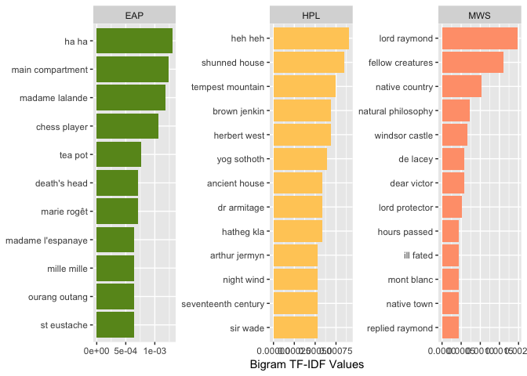

Um... I have the indistinct feeling that both Poe and Lovecraft are laughing at us. If there is only one thing in the world that should make you feel uneasy, it's probably laughter from those two.

We also find:

-   Besides cruel humour, for Poe it's all about "chess players" and "tea pots". We've also got a few more names and, apparently, a fair share of "Orang Utan" appearances.

-   Lovecraft sets the scence with "ancient houses" and "shunned houses" during the "seventeenth century". Also he has a couple of characteristic character names.

-   So has Mary Shelly, who seems to really like "Lord Raymond". Well, everybody loves Raymond, don't they? We also find a few turns of phrase that are typical for her, such as "fellow creatures", "hours passed", or "ill fated". *Let's hope that the latter is not an omen for our own expedition into the heart of the darkness ...*

### 2.2 First Two Words(Will be used for sentence generation)

Let's find how these authors start their sentence. Does anyone of them have some special writing style to surperise you at the first sight?

*I will use these first words to to generate sentence for each author in the Part 2 (5).Hope It could seem like their own style and become another "spooky novel" *

``` r
spooky$first_two<-word(spooky$text, 1,2, sep=" ")
spooky_first_two<-spooky%>%
  count(author,first_two)%>%
  arrange(desc(n,author))

spooky_first_two1 <- ungroup(top_n(group_by(spooky_first_two, author), 20, n))

p1<-spooky_first_two1 %>%
  ggplot(aes(reorder(first_two,n), n, fill = author), position = position_stack(reverse = TRUE)) +
  geom_col() +
  labs(x = NULL, y = "Number of Appearance") +
  theme(legend.position = "none",axis.text.x  = element_text(angle=45, hjust=1, vjust=0.9))+ 
  scale_fill_manual(values = c("#689420", "#FFCC66",fillColor))

p2<-spooky_first_two1 %>%
  ggplot(aes(reorder(first_two,n), n, fill = author), position = position_stack(reverse = TRUE)) +
  geom_col() +
  labs(x = NULL, y = "Number of Appearance") +
  theme(legend.position = "none")+
  facet_wrap(~ author, ncol = 3, scales = "free") +
  coord_flip()+ 
  scale_fill_manual(values = c("#689420", "#FFCC66",fillColor))

layout <- matrix(c(1, 2), 2, 1, byrow = TRUE)
multiplot(p1, p2, layout = layout)
```

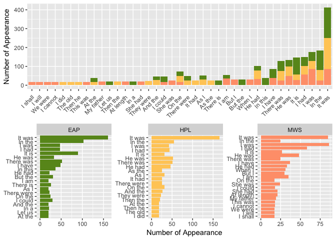

"It was" is the most popular way to start the sentence for all of these authors. Then come "In the","I was","I had","It is","He was","There was". Seems like my writing style... Simple and nothing special. But when we have a closer look for each author,there comes difference!

-   EAP and HPL have very similar Starting Words, EAP used more "In the" and "It is" than HPL. Souds like EAP has more to explain in the sentence and stored lots of information.

-   EAP seems like the most normal author when starting the sentence, EAP almost has no "own" starting words while HPL has a perference for "As the","It had","There were","Then he","The old","I did"

-   MWS seems has her own style to start the sentence. MWS used a small percentage common words for starting. She showed a strong love to start with "I was","I shall","I had","We were","I cannot","But I"... She usually start with Personal Pronouns, especially "I". Maybe MWS made more efforts to make readers have similar feeling with her or get addicted to her stories?

*According to the frequency, I would select "It was" for EAP and HPL to generate "their" sentences. "I was" will be prepared for MWS *

3. Trigrams
-----------

### 3.1 Without Stopwords

*Three is a magical number. A terrible number. There were 3 witches to foretell Macbeth his blood-drenched destiny. The devil hound Cerberus has 3 heads. The number of the beast is 3 times the number 3+3. All these warning signs try to reach our concience as we prepare to repeat the same analysis we had done for bigrams on their cousins thrice removed: trigrams.*

*Blind for knowledge, yielding to the call of power just like the sorcerer's apprentice, we continue our study. We crave to know more. A little spark of reason and self-preservation is trying to make itself heard against the raging thirst in our brains, but it burns ever weaker as the candle, is it still a candle?, shines brighter and brighter.*

Extracting trigrams follows the same procedure as for bigrams. Again we filter out stop words and include a few random examples:

``` r
t3 <- spooky %>% select(author, text) %>% unnest_tokens(trigram, text, token = "ngrams", n = 3)

tri_sep <- t3 %>%
  separate(trigram, c("word1", "word2", "word3"), sep = " ")

tri_filt <- tri_sep %>%
  filter(!word1 %in% stop_words$word) %>%
  filter(!word2 %in% stop_words$word) %>%
  filter(!word3 %in% stop_words$word)

# for later
trigram_counts <- tri_filt %>%
  count(word1, word2, word3, sort = TRUE)

t3 <- tri_filt %>%
  unite(trigram, word1, word2, word3, sep = " ")

sample_n(t3, 5)
```

    ##       author                        trigram
    ## 11921    MWS           precious human blood
    ## 11395    MWS               thirsty war dogs
    ## 6603     HPL        massive exposed rafters
    ## 704      EAP presence singularly commanding
    ## 11981    MWS           rich furs glittering

And here is the corresponding TF-IDF plot for the most characteristic terms:

``` r
t3_tf_idf <- t3 %>%
  count(author, trigram) %>%
  bind_tf_idf(trigram, author, n) %>%
  arrange(desc(tf_idf))

t3_tf_idf %>%
  arrange(desc(tf_idf)) %>%
  mutate(trigram = factor(trigram, levels = rev(unique(trigram)))) %>%
  group_by(author) %>%
  top_n(5, tf_idf) %>%
  ungroup() %>%  
  ggplot(aes(trigram, tf_idf, fill = author)) +
  geom_col() +
  labs(x = NULL, y = "Trigram TF-IDF Values Without Stopwords") +
  theme(legend.position = "none") +
  facet_wrap(~ author, ncol = 3, scales = "free") +
  coord_flip()+ 
  scale_fill_manual(values = c("#689420", "#FFCC66",fillColor))
```

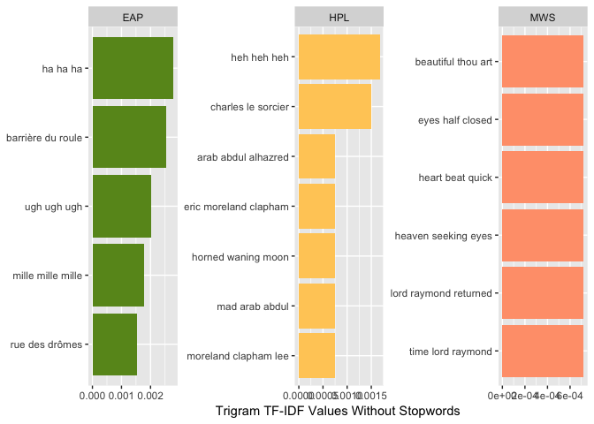

We find:

-   More scary laughter and characteristic names from Poe and Lovecraft. Feel free to admit that you also read "Eric Moreland Clap**ton**" at first glance in HPL's list. I like the imagery of a "horned waning moon".

-   Curiously, Mary Shelley does not seem to have particularly typical phrases she repeats more often than others. The ones she does use suggest a penchant for body language, especially the eyes.

-   Most importantly, though, we find out that Raymond was from [Galifrey](https://en.wikipedia.org/wiki/Time_Lord). That might explain why he's so popular and why he manages to exert such a strong influence on Shelley's writing.

### 3.2 With Stopwords

This time let's put stopwords into consideration and see whether it could add more interests in their expression.

``` r
trigram_counts2 <- tri_sep %>%
  count(word1, word2, word3, sort = TRUE)

t31 <- tri_sep %>%
  unite(trigram, word1, word2, word3, sep = " ")

t3_tf_idf1 <- t31 %>%
  count(author, trigram) %>%
  bind_tf_idf(trigram, author, n) %>%
  arrange(desc(tf_idf))

t3_tf_idf1 %>%
  arrange(desc(tf_idf)) %>%
  mutate(trigram = factor(trigram, levels = rev(unique(trigram)))) %>%
  group_by(author) %>%
  top_n(5, tf_idf) %>%
  ungroup() %>%  
  ggplot(aes(trigram, tf_idf, fill = author)) +
  geom_col() +
  labs(x = NULL, y = "Trigram TF-IDF Values With Stopwords") +
  theme(legend.position = "none") +
  facet_wrap(~ author, ncol = 3, scales = "free") +
  coord_flip()+ 
  scale_fill_manual(values = c("#689420", "#FFCC66",fillColor))
```

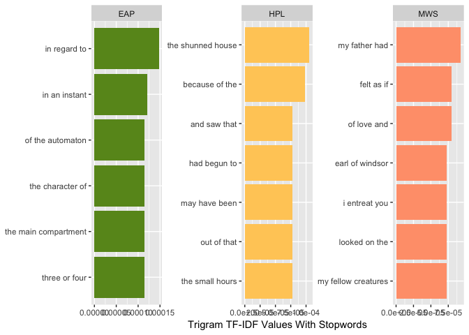

We find:

-   EAP and HPL are still similar for their writing styles. Their trigrams are almost all conjunctions which didn't provide much information

-   EAP used "three or four" frequently. Checking back to the original sentences, what follows the quantitive amout is usually time("weeks","hours","days"...). Seems like EAP tends to describe things vaguely and create some unclear concepts for reader to guess?

-   HPL are fond of houses! Could he afford his own house back to his time? The high house price made him scary so he made some virtural houses in his stories ??

-   MWS gives more information on this part. My father?? My fellow creatures?? I entreat you?? She really loves using person prons in the sentence. Her trigram doesn't seems could be compiled to a spooky novel... It made me feel warm...

4. Feature Engineering
----------------------

We'll do some simple numerical summaries of the data to provide some nice visualizations.Here we add some Features to the `spooky` datasets. The fatures are

-   Number of commas, semicolons, colons, questions

-   Number of blanks,others

-   Number of words beginning with Capitals, words with Capitals

-   Number of words,stopwords,negation words

-   Sentence length(characters); Word length(characters)

We may find some traces how these author *cooking* their horrible books!

Some these features have been borrowed from Kaggler *jayjay* 's kernel found [here](https://www.kaggle.com/jayjay75/text2vec-glmnet). Great work jayjay!

``` r
createFE = function(ds)
{
  ds = ds %>%
  mutate(Ncommas = str_count(ds$text, ",")) %>%
  mutate(Nsemicolumns = str_count(ds$text, ";")) %>%
  mutate(Ncolons = str_count(ds$text, ":")) %>%
  mutate(Nblank = str_count(ds$text, " ")) %>%
  mutate(Nother = str_count(ds$text, "[\\.\\.]")) %>%
  mutate(Ncapitalfirst = str_count(ds$text, " [A-Z][a-z]")) %>%
  mutate(Ncapital = str_count(ds$text, "[A-Z]")) %>%
  mutate(Nquestion = str_count(ds$text,"\\?")) 

  return(ds)
}
spooky_feature = createFE(spooky)
```

### 4.1 Sentence Ingredients

Here comes their "Sentence Ingredients"! This part tell us How Much Special Ingredients they Add in Their Stories.

First is the number of Capital they used

``` r
spooky_feature %>%
  group_by(author) %>%
  summarise(SumCapital = sum(Ncapital,na.rm = TRUE)) %>%
  ungroup() %>%
  mutate(author = reorder(author,SumCapital)) %>%
  
  ggplot(aes(x = author,y = SumCapital)) +
  geom_bar(stat='identity',colour="white", fill = fillColor) +
  geom_text(aes(x = author, y = 1, label = paste0("(",SumCapital,")",sep="")),
            hjust=0, vjust=.5, size = 4, colour = 'black',
            fontface = 'bold') +
  labs(x = 'Author', 
       y = 'Numbers', 
       title = 'Total Number of Capital Letters') +
  coord_flip() + 
  theme_bw()
```

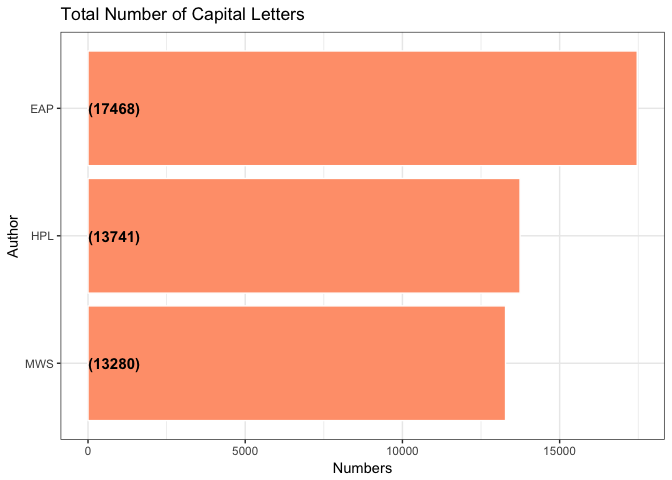

-   Seems like EAP used more Capital Letters, but there are also more sentence included in the dataset writen by EAP.(EAP,HPL,MWS :7900,5635,6044) After calculating the Captical Letters Per Sentence, HPL won! EAP and MWS have an average of 2.2 per sentence while HPL has 2.4.

Next comes the number of words in a sentence.

``` r
spooky_feature$Nwords <- sapply(gregexpr("\\W+", spooky_feature$text), length) + 1
ggplot(spooky_feature) + 
  geom_boxplot(aes(x=author, y=Nwords,fill=author))+ 
  scale_fill_manual(values = c("#689420", "#FFCC66",fillColor))+
  labs(x = 'Author', 
       y = 'Number of Words', 
       title = 'Total Number of Words') 
```

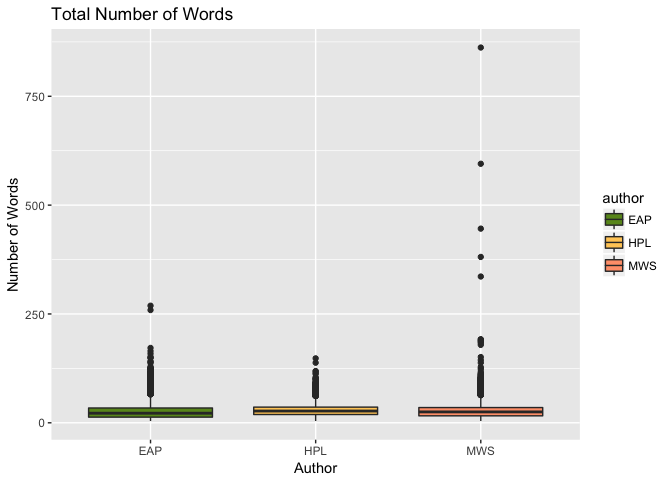

-   HPL has a relatively long sentence than others while MWS occassionaly write some extrmely long sentence.

-   HPL is very stable and have a steady performance when add words into his stories while MWS seems very flexible and sometimes may have A Burst of Inspiration??

Then comes number of stopwords in a sentence

``` r
nostopword<-as.data.frame(table(spooky_wrdnew$id))
names(nostopword)<-c("id","num_of_nostop_wrd")
spooky_feature<-merge(spooky_feature,nostopword,by="id",all=T)
spooky_feature$num_of_nostop_wrd[is.na(spooky_feature$num_of_nostop_wrd)]<-0
spooky_feature$Nstop<-spooky_feature$Nwords - spooky_feature$num_of_nostop_wrd

ggplot(spooky_feature) +
      geom_density_ridges(aes(Nstop, author, fill = author)) +
      scale_x_log10() +
      theme(legend.position = "none") +
      labs(x = "Number of StopWords")+ 
  scale_fill_manual(values = c("#689420", "#FFCC66",fillColor))
```

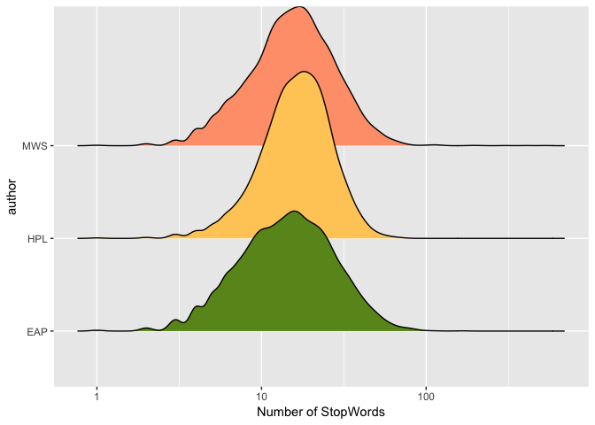

-   MWS used less stopwords than other two, which could also be found from her trigram.

At last, it is the number of negation words in a sentence

**Negation Words**:
Different from negative words in sentiment analysis,including:
*Negative words*:   no,not,none,no one,nobody,nothing,neither,nowhere,never
*Negative Adverbs*: hardly,scarcely,barely
*Negative verbs*:   doesn’t,isn’t,wasn’t,shouldn’t,wouldn’t,couldn’t,won’t,can’t,don’t
*Others*:        little,few,nor,without,unless...

I didn't find an existing word list for this. So I just generated a list by myself. Correct me if I am wrong.

``` r
negation<-c("no","not","none","nobody","nothing","neither","nowhere","never","hardly","scarcely","barely","doesn't","isn't","wasn't","shouldn't","wouldn't","didn't","won't","can't","little","few","nor","neither","without","unless","wa'n't","dun't","dxn't","aren't","hasn't","couldn't","hadn't","don't","mustn't","ain't","haven't","wudn't","weren't")
spooky_wrd$negation <- spooky_wrd$word %in% negation
negationwrd<-as.data.frame(table(spooky_wrd$id[spooky_wrd$negation==T] ))
names(negationwrd)<-c("id","num_of_negation_wrd")
spooky_feature<-merge(spooky_feature,negationwrd,by="id",all=T)
spooky_feature$num_of_negation_wrd[is.na(spooky_feature$num_of_negation_wrd)]<-0

ggplot(spooky_feature) + 
  geom_boxplot(aes(x=author, y=num_of_negation_wrd,fill=author))+ 
  scale_fill_manual(values = c("#689420", "#FFCC66",fillColor))+
  labs(x = 'Author', 
       y = 'Number of Negation Words', 
       title = 'Total Number of Negation Words') 
```

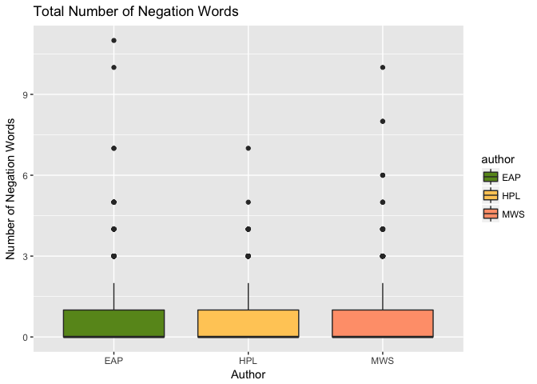

-   They almost have the same performance and only EAP may use a little more negation words.

Overall, we could find HPL has a very good writing habit, moderate length, moderate words number, Good example for us. He may never added too much butter to his bread...

### 4.2 Sentence Seasoning(Punctuations)

After checking their ingradients, what did they put for the "Flavour"? The bar plot shows the authors with the Total Number of Commas, SemiColons, Colons, Questions used by them. Still, be careful because EAP appeared more ofen than others.

``` r
p1<-spooky_feature %>%
  group_by(author) %>%
  summarise(SumCommas = sum(Ncommas,na.rm = TRUE)) %>%
  ungroup() %>%
  mutate(author = reorder(author,SumCommas)) %>%
  
  ggplot(aes(x = author,y = SumCommas)) +
  geom_bar(stat='identity',colour="white", fill = fillColor2) +
  geom_text(aes(x = author, y = 1, label = paste0("(",SumCommas,")",sep="")),
            hjust=0, vjust=.5, size = 4, colour = 'black',
            fontface = 'bold') +
  labs(x = 'author', 
       y = 'Commas', 
       title = 'Total Number of Commas') +
  coord_flip() + 
  theme_bw()

p2<-spooky_feature %>%
  group_by(author) %>%
  summarise(SumSemiColons = sum(Nsemicolumns,na.rm = TRUE)) %>%
  ungroup() %>%
  mutate(author = reorder(author,SumSemiColons)) %>%
  
  ggplot(aes(x = author,y = SumSemiColons)) +
  geom_bar(stat='identity',colour="white", fill = fillColor) +
  geom_text(aes(x = author, y = 1, label = paste0("(",SumSemiColons,")",sep="")),
            hjust=0, vjust=.5, size = 4, colour = 'black',
            fontface = 'bold') +
  labs(x = 'author', 
       y = 'SemiColons', 
       title = 'Total Number of SemiColons') +
  coord_flip() + 
  theme_bw()

p3<-spooky_feature %>%
  group_by(author) %>%
  summarise(SumColons = sum(Ncolons,na.rm = TRUE)) %>%
  ungroup() %>%
  mutate(author = reorder(author,SumColons)) %>%
  
  ggplot(aes(x = author,y = SumColons)) +
  geom_bar(stat='identity',colour="white", fill = fillColor2) +
  geom_text(aes(x = author, y = 1, label = paste0("(",SumColons,")",sep="")),
            hjust=0, vjust=.5, size = 4, colour = 'black',
            fontface = 'bold') +
  labs(x = 'author', 
       y = 'Colons', 
       title = 'Total Number of Colons') +
  coord_flip() + 
  theme_bw()

p4<-spooky_feature %>%
  group_by(author) %>%
  summarise(SumQuestions = sum(Nquestion,na.rm = TRUE)) %>%
  ungroup() %>%
  mutate(author = reorder(author,SumQuestions)) %>%
  
  ggplot(aes(x = author,y = SumQuestions)) +
  geom_bar(stat='identity',colour="white", fill = fillColor) +
  geom_text(aes(x = author, y = 1, label = paste0("(",SumQuestions,")",sep="")),
            hjust=0, vjust=.5, size = 4, colour = 'black',
            fontface = 'bold') +
  labs(x = 'author', 
       y = 'Questions', 
       title = 'Total Number of Questions') +
  coord_flip() + 
  theme_bw()

layout <- matrix(c(1, 2, 3, 4), 2, 2, byrow = TRUE)
multiplot(p1, p2, p3,p4, layout = layout)
```

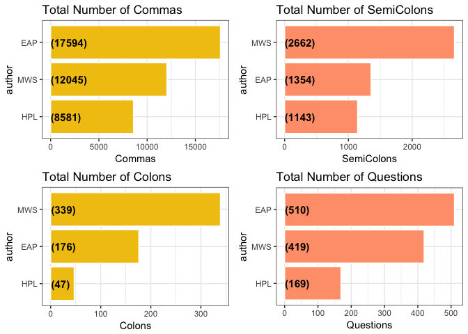

-   HPL cherishes his Commas, Colons and Questions and only used little seasoning...

-   MWS is almost wasting Semicolons and Colons compared to others...

5. Sentence Generation
----------------------

In the current example I’m using all the phrases I extracted from the trigrams. And then will use words that follow each other choosing “randomly” but weighted by occurrence.

What I actually created is a trigram dataframe, and a function that searches that frame. The function takes two words and returns all the rows where the first word matches the first column and the second word matches the second column.

Furthermore I made a sentence creator, a function where you supply the first two words and the length of the sentence. That function keeps using the last words in the sentence until the correct length is achieved. With the fallback method of using bigrams when the trigrams don’t work anymore it could still fail, but not so often.

My endproduct takes two words and tries to find a third word. Then it takes the final two words and tries to find another word untill the sentance has a length that I specify at the start.

According to what we got from Part 2 (2.2), I generated sentences using the most frequent starting words used by each author. "It was","It was","I was" for EAP HPL and MWS respectively.

*Please input sentence length above 3*
*If there are imporper word inputed(such as "i" & "no" which couldn't be linked together used as approporite starting words for a sentence), it will print "Change the starting words or sentence length/Rerun the code"*

``` r
#trigram of authors
trigrams_EAP <- spooky %>%
        filter(author == "EAP") %>%
        unnest_tokens(trigram, text, token = "ngrams",to_lower = TRUE, n= 3) %>%
        separate(trigram, c("word1", "word2", "word3"), sep = " ") %>%
        count(word1, word2,word3, sort = TRUE)
trigrams_HPL <- spooky %>%
        filter(author == "HPL") %>%
        unnest_tokens(trigram, text, token = "ngrams",to_lower = TRUE, n= 3) %>%
        separate(trigram, c("word1", "word2", "word3"), sep = " ") %>%
        count(word1, word2,word3, sort = TRUE)
trigrams_MWS <- spooky %>%
        filter(author == "MWS") %>%
        unnest_tokens(trigram, text, token = "ngrams",to_lower = TRUE, n= 3) %>%
        separate(trigram, c("word1", "word2", "word3"), sep = " ") %>%
        count(word1, word2,word3, sort = TRUE)

##sentence generator
return_third_word <- function( woord1, woord2,authordata){
        temp<-authordata%>%
          filter_(~word1 == woord1, ~word2 == woord2)
        if (dim(temp)[1]==0){
          print("Change the starting words or sentence length you inputed/Rerun the code")
        }
        else{
        woord <- temp %>%
                sample_n(size=1, weight = n,replace = T) %>%
                .[["word3"]]
        #seems useless?
        if(length(woord) == 0){
                bleh <- filter_(authordata, ~word1 == woord2) %>%
                        sample_n(1, weight = n)
                warning("no word found, adding ", bleh, "to", woord1 , woord2)
                woord <- bleh
        }
        woord
        }
}
#for test: return_third_word("i","s",trigrams_EAP)
generate_sentence <- function(word1, word2,authordata, sentencelength =5, debug =FALSE){
        #input validation
        #if(sentencelength <3)stop("I need more to work with")
        sentencelength <- sentencelength -2
        # starting
        sentence <- c(word1, word2)
        woord1 <- word1
        woord2 <- word2
        for(i in seq_len(sentencelength)){
                #if(debug == TRUE)print(i)
                word <- return_third_word( woord1, woord2, authordata )
               # if(return_third_word( woord1, woord2, authordata )=="Change the word you inputed")
                #  print("Rerun please")else
                sentence <- c(sentence, word)
                woord1 <- woord2
                woord2 <- word
        }
        output <-paste(sentence, collapse = " ")
        output
}
generate_sentence("it", "was",trigrams_EAP, 6)
```

    ## [1] "it was at length said hoarsely"

``` r
generate_sentence("it", "was",trigrams_HPL, 6)
```

    ## [1] "it was still alone for one"

``` r
generate_sentence("i", "was",trigrams_MWS, 6)
```

    ## [1] "i was led by my sudden"

Examples with the most frequent starting words for each author:

\*EAP

\[1\] "it was only with difficulty shake off incumbent eternally upon my word mark that"

\[1\] "it was her beauty in my opinion by certain superstitious impressions in view of"

\[1\] "it was sitting alone in his eyes became unwittingly rivetted"

\[1\] "it was clear that the doom prepared for me"

\[1\] "it was the last eventful scene of the magnificent"

\*HPL

\[1\] "it was his mountain freedom that he thought he heard about the matter for speculation"

\[1\] "it was at a glance doubly absurd since the garret chamber were wholly beyond conjecture"

\[1\] "it was the ultimate things i have dwelt ever in realms apart from their"

\[1\] "it was probably merely a fresh bending and matting visible"

\[1\] "it was not his own hands reached out to uncurl"

\*MWS

\[1\] "i was gradually recovering i was shut out from crackling branches of the seas rather"

\[1\] "i was perplexed and unable to arrange my ideas seemed to hold out longer"

\[1\] "i was acting for the cottage they consisted of paradise"

\[1\] "i was happy and with a reinforcement they had"

\[1\] "i was gradually recovering i was so much desired"

We could change the first two words, author number of words in the sentence. But usually the shorter the sentence, the more reasonable the meaning.

I didn't get too much insight from the "Machine Sentence" hhh. From my perspective, the only difference is there are more strange words I am unfamilar with in EAP and HPL's sentences...Seems like MWS is more user friendly?

We could explore more about how those authors describe the world or life or anything else in their sentence by changing the first two words. This may reflect their attitudes and values.

How they describe the world

``` r
generate_sentence("world", "was",trigrams_EAP, 6)
```

    ## [1] "world was still a very profound"

``` r
generate_sentence("world", "was",trigrams_HPL, 6)
```

    ## [1] "world was made of specimens in"

``` r
generate_sentence("world", "was",trigrams_MWS, 6)
```

    ## [1] "world was to be regarded with"

\*EAP

\[1\] "the world grew dark before mine"

\[1\] "the world grew dark before mine eyes in an attitude"

\*HPL

\[1\] "the world or no longer controls"

\[1\] "the world battling against blackness against the rotting remains of"

\*MWS

\[1\] "the world had grown stale to"

\[1\] "the world is come before dawn i led a young"

How they describe life.

``` r
generate_sentence("life", "was",trigrams_EAP, 6)
```

    ## [1] "life was the lightest vapors never"

``` r
generate_sentence("life", "was",trigrams_HPL, 6)
```

    ## [1] "life was confined to his notorious"

``` r
generate_sentence("life", "was",trigrams_MWS, 6)
```

    ## [1] "Change the starting words or sentence length you inputed/Rerun the code"
    ## [1] "Change the starting words or sentence length you inputed/Rerun the code"

    ## [1] "life was now doing Change the starting words or sentence length you inputed/Rerun the code Change the starting words or sentence length you inputed/Rerun the code"

\*EAP

\[1\] "life was in search of the calling a"

\[1\] "life was in truth the masquerade license of"

\*HPL

\[1\] "life was known to barzai the wise shrieking"

\[1\] "life was confined to the southeast and now"

\*MWS

\[1\] "life was now united to his past life"

\[1\] "life was now awake she was miserable and"

\*All the generated sentences are not so positive, fulling with "dark" and "miserable".

Part 3 Sentiment Analysis
=========================

1. Word Level
-------------

We examine the following sentiments using `NRC Sentiment lexicon`
The NRC Emotion Lexicon is a list of English words and their associations with eight basic emotions (anger, fear, anticipation, trust, surprise, sadness, joy, and disgust) and two sentiments (negative and positive). The annotations were manually done by crowdsourcing."

From *[Text Mining with R; A Tidy Approach](https://www.tidytextmining.com)*, "When human readers approach text, we use our understanding of the emotional intent of words to infer whether a section of text is positive or negative, or perhaps characterized by some other more nuanced emotion like surprise or disgust. We can also use the tools of text mining to approach the emotional content of text programmatically." This is the goal of sentiment analysis.

The plots below show authors with amount of words for different emotions.

``` r
plotEmotions = function(emotion,fillColor = fillColor2)
{
  nrcEmotions = get_sentiments("nrc") %>% 
  filter(sentiment == emotion)
spooky_wrdnew[,-4] %>%
  inner_join(nrcEmotions)  %>%
  group_by(author) %>%
  summarise(Count = n()) %>%
  ungroup() %>%
  mutate(author = reorder(author,Count)) %>%
  
  ggplot(aes(x = author,y = Count)) +
  geom_bar(stat='identity',colour="white", fill =fillColor) +
  geom_text(aes(x = author, y = 1, label = paste0("(",Count,")",sep="")),
            hjust=0, vjust=.5, size = 4, colour = 'black',
            fontface = 'bold') +
  labs(x = 'author', y = 'Count', 
       title = paste0('Author and ',emotion,' Words ')) +
  coord_flip() + 
  theme_bw()
}
trustplot<-plotEmotions(unique(get_sentiments("nrc")$sentiment)[1])
fearplot<-plotEmotions(unique(get_sentiments("nrc")$sentiment)[2])
negativeplot<-plotEmotions(unique(get_sentiments("nrc")$sentiment)[3])
sadnessplot<-plotEmotions(unique(get_sentiments("nrc")$sentiment)[4])
angerplot<-plotEmotions(unique(get_sentiments("nrc")$sentiment)[5])
surpriseplot<-plotEmotions(unique(get_sentiments("nrc")$sentiment)[6])
positiveplot<-plotEmotions(unique(get_sentiments("nrc")$sentiment)[7])
disgustplot<-plotEmotions(unique(get_sentiments("nrc")$sentiment)[8])
joyplot<-plotEmotions(unique(get_sentiments("nrc")$sentiment)[9])
anticipationplot<-plotEmotions(unique(get_sentiments("nrc")$sentiment)[10])
layout1 <- matrix(c(1,2,3,4), 2, 2, byrow = TRUE)
```

First, I plotted relatively "dark" emotions

``` r
multiplot(disgustplot, fearplot,angerplot,sadnessplot,layout = layout1)
```

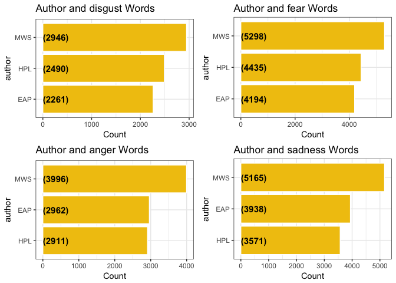

-   MWS is quite emotional and used lots of "dark" words.

-   HPL used more Disgust and Fear words for sentimental expression.

-   EAP used more Anger and Sadness words in the sentences.

Then, I plotted other emotions in the sentences

``` r
multiplot(trustplot, surpriseplot,joyplot,anticipationplot,layout = layout1)
```

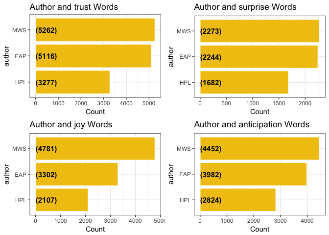

-   MWS also used more "normal" and "light" words than others.

-   HPL is always the author used least sentiment words in this plot. Compared to lasst plot, HPL is more frequent to use "dark" sentiment words

Last, I plotted the amount of positive/negative words for each author

``` r
layout2 <- matrix(c(1,2),1, 2, byrow = TRUE)
multiplot(negativeplot, positiveplot,layout = layout2)
```

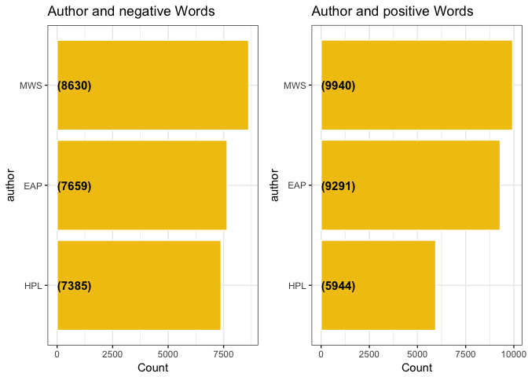

-   Overall, seems like MWS used more sentimental words than other authors. Maybe because female author is more likely to express her feeling. HPL used least sentimental words no matter they are positive or negative.

Next, I used table and plots to see what percentage of their words are sentimental words.

Their total number of words:

``` r
allwords<-as.data.frame(get_sentiments("nrc")$word)
names(allwords)<-"word"
emotionwrd<-spooky_wrdnew[,-4] %>%
  inner_join(allwords) %>%
  group_by(author) %>%
  summarise(Count = n()) %>%
  ungroup() %>%
  mutate(author = reorder(author,Count)) 
#emotionwrd
emotionwrd$Totalwrd<-as.data.frame(table(spooky_wrdnew$author))$Freq
names(emotionwrd)[2]<-"emotionwrd"
emotionwrd$percent<-emotionwrd$emotionwrd/emotionwrd$Totalwrd
emotionwrd
```

    ## # A tibble: 3 x 4
    ##   author emotionwrd Totalwrd percent
    ##   <fctr>      <int>    <int>   <dbl>
    ## 1 EAP         44949    72844   0.617
    ## 2 HPL         36626    62371   0.587
    ## 3 MWS         52743    62492   0.844

``` r
totalwrd<-ggplot(emotionwrd, aes(x = author, y = Totalwrd, fill = author)) + 
  geom_bar(stat = "identity", colour = "black") + 
  scale_fill_manual(values = c("#689420", "#FFCC66",fillColor))+
  geom_text(aes(label = Totalwrd),hjust=0.5,vjust=0, size = 4, colour = 'black',
            fontface = 'bold')+
  labs(x = NULL, y = "Total Number of Words") 
```

Their percentage of emotional words

``` r
peremowrd<-ggplot(emotionwrd,aes(author,percent,fill = author))+
  geom_bar(stat= 'identity', colour = "black")+ 
  scale_fill_manual(values = c("#689420", "#FFCC66",fillColor))+
  labs(x = NULL, y = "Percentage of Emotion Words") 
multiplot(totalwrd, peremowrd,layout = layout2)
```

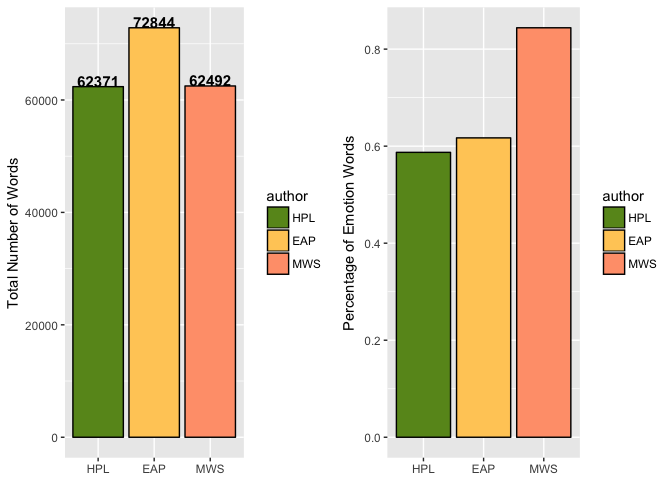

-   We could find MWS is quite emotional, Almost 85% of her words(except stopwords) are emotional words, she is almost 25% higher than other two male authors.

-   HPL is more introvert when he writes the sentence and didn't show his feelings a lot. HPL is more "machine-like" author who is cool and calm.

We put all emotional feelings together now.

``` r
sentiments <- inner_join(spooky_wrd, get_sentiments('nrc'), by = "word")

ggplot(count(sentiments, author, sentiment)) + 
  geom_col(aes(sentiment, n, fill = author),position='dodge', colour = "black")+ 
  scale_fill_manual(values = c("#689420", "#FFCC66",fillColor))+
  labs(x = NULL, y = "Count") 
```

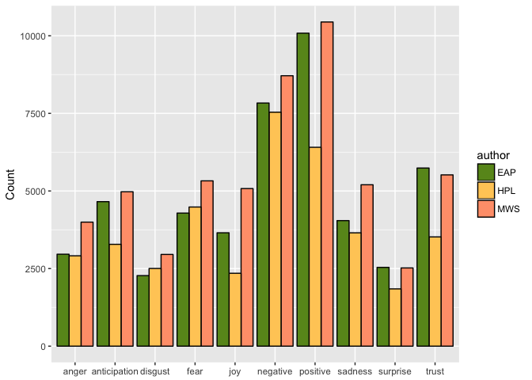

-   MWS used Trust, Fear and Sadness most among eight emotional feelings.

-   HPL used Fear most and he is the only author who used Negative words more than Positive. He is also "mean" when using Joy.

-   EAP used Trust most and lots of Anticipation words.

-   Among those emotional words, Surprise and Disgust appeared less than others

2. Sentence Level
-----------------

I examine the following sentiments using `afinn Sentiment lexicon`
The AFINN lexicon assigns words with a score that runs between -5 and 5, with negative scores indicating negative sentiment and positive scores indicating positive sentiment.
I used "afinn" sentiment lexicon to score the words in the sentence and calculate the average score for the sentence sentiment.

First, I will show some "affinn" score.

``` r
sample_n(get_sentiments("afinn"),10)
```

    ## # A tibble: 10 x 2
    ##    word         score
    ##    <chr>        <int>
    ##  1 horrible        -3
    ##  2 reached          1
    ##  3 strengthens      2
    ##  4 defect          -3
    ##  5 worse           -3
    ##  6 enrages         -2
    ##  7 deceit          -3
    ##  8 excited          3
    ##  9 join             1
    ## 10 perpetrators    -2

Calculate sentiment scores for each sentence. Showed the highest 10 score among all sentences

``` r
sentiment_lines <-spooky_wrd %>%
  inner_join(get_sentiments("afinn"), by = "word") %>%
  group_by(id) %>%
  summarize(sentiment = mean(score))

sentiment_lines = sentiment_lines %>%
    right_join(spooky_wrd, by = "id") 

sentiment_lines = sentiment_lines %>% mutate(sentiment = ifelse(is.na(sentiment),0,sentiment))

sentiscore<-sentiment_lines[,1:3]
sentiscore<-sentiscore[!duplicated(sentiscore),]%>%
  arrange(desc(sentiment,author))

head(sentiscore,15)
```

    ## # A tibble: 15 x 3
    ##    id      sentiment author
    ##    <chr>       <dbl> <fctr>
    ##  1 id10196      5.00 EAP   
    ##  2 id07548      5.00 EAP   
    ##  3 id25394      5.00 EAP   
    ##  4 id05517      5.00 EAP   
    ##  5 id20925      4.00 HPL   
    ##  6 id27698      4.00 EAP   
    ##  7 id01902      4.00 EAP   
    ##  8 id18191      4.00 HPL   
    ##  9 id24735      4.00 HPL   
    ## 10 id06517      4.00 EAP   
    ## 11 id05414      4.00 HPL   
    ## 12 id11420      4.00 EAP   
    ## 13 id03133      4.00 EAP   
    ## 14 id21073      4.00 HPL   
    ## 15 id08642      4.00 MWS

\*EAP is way more positive over the setence level tham other authors. Sentences with the highest score are:

**id10196**: "I thought so I knew it hurrah" vociferated Legrand, letting the negro go, and executing a series of curvets and caracols, much to the astonishment of his valet, who, arising from his knees, looked, mutely, from his master to myself, and then from myself to his master.

**id07548**: My original soul seemed, at once, to take its flight from my body and a more than fiendish malevolence, gin nurtured, thrilled every fibre of my frame.

**id25394**: "Superb physiologist" said the Westminster.

Then I calculated the average sentence score for each author.

``` r
avescore<-sentiscore%>%
  group_by(author) %>%
  summarise(mean(sentiment)) %>%
  ungroup()
names(avescore)[2]<-"score"

ggplot(data = avescore ,aes(x = factor(author), y = score, fill = author))+ 
  geom_bar(stat = 'identity')+ 
  scale_fill_manual(values = c("#689420", "#FFCC66",fillColor))+
  labs(x = "Author", y = "Average Sentiment Score") 
```

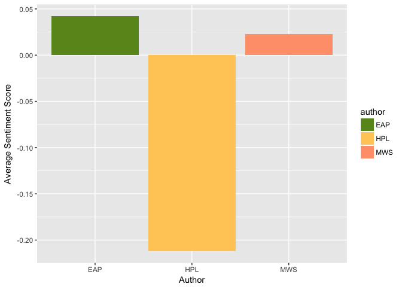

-   No surprising that HPL has a negative average score.

-   It is a little surprise when I found EAP got the highest score. because MWS is the author who used more positive and good sentiment words in *NRC* lexicon.

I listed hightest and lowest score setences of each author here(Selected randomly if there are same scores).

Highest:

-   EAP(5): id05517: The apartment was superb.

-   HPL(4): id20925: Wonderful likewise were the gardens made by Zokkar the olden king.

-   MWS(4): id08642: But for one thing he would have been completely triumphant.

Lowest:

-   EAP(-4): id22475: In the former, the torture of meditation was excessive in the latter, supreme.

-   HPL(-5): id05489: We shall see that at which dogs howl in the dark, and that at which cats prick up their ears after midnight.

-   MWS(-4): id11965: Perdita, who then resided with Evadne, saw the torture that Adrian endured.

Part 4 Data Prediction
======================

1. MultinomialLogistics Regression...
-------------------------------------

I tried to use "Ncommas", "Nsemicolumns", "Ncolons", "Ncapital", "Nquestion", "Nwords", "num\_of\_negation\_wrd", "sen\_length" to predict the author...but stuck in this part... I listed some materials I used for the code but I still didn't fully understand the principle of Multinominal Logistics Regression.

Please correct me.

Links:

*[How to: Multinomial regression models in R](https://www.r-bloggers.com/how-to-multinomial-regression-models-in-r/)*

*[R examples](https://stats.idre.ucla.edu/r/dae/multinomial-logistic-regression/)*

*[How to: Multinomial regression models in R](https://www.r-bloggers.com/how-to-multinomial-regression-models-in-r/)*

First I added sentence length(characters) and word length(characters) to dataset.

``` r
spooky$sen_length <- str_length(spooky$text) 
spooky_wrdnew$word_length <- str_length(spooky_wrdnew$word)
```

Used correlation plots to delete variables which have high correlations.

*You may need to download the package **corrplot** to run the code.*

``` r
spooky_feature$sen_length<-spooky$sen_length
regressiondata<-spooky_feature[,c(-1,-2,-4,-8,-9,-10,-14)]
#install.packages("corrplot")
library(corrplot)
```

    ## corrplot 0.84 loaded

``` r
m<-cor(regressiondata[,2:10])
corrplot(m, type = "upper", order = "hclust", tl.col = "black", tl.srt = 45,method = "number")
```

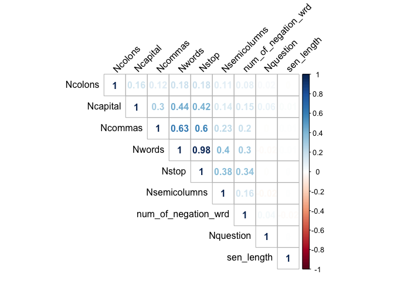

I found number of words has a high correlation with number of stopwords,so I deleted the number of stop words from the variables. Correlation again.

``` r
regressiondata<-regressiondata[,-8]
m1<-cor(regressiondata[,2:9])
corrplot.mixed(m1, lower.col = "black", number.cex = .7)
```

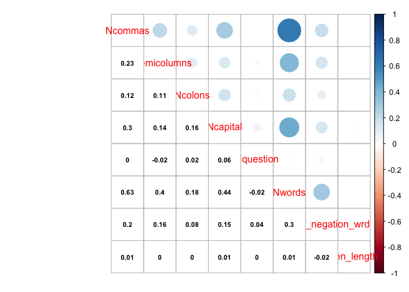

Separate dataset into train and test.

``` r
set.seed(4243)
sample<-sample.int(n=nrow(regressiondata),size=floor(0.75*nrow(regressiondata)),replace=F)
train<-regressiondata[sample, ]
test<-regressiondata[-sample, ]
```

Here comes my nightmare...

*You may need to download the package **nnet** to run the code.*

``` r
library(nnet)
mult<-multinom(author~.,data=train)
```

    ## # weights:  30 (18 variable)
    ## initial  value 16132.022847 
    ## iter  10 value 15332.423553
    ## iter  20 value 15015.983491
    ## final  value 14950.268598 
    ## converged

``` r
summary(mult)
```

    ## Call:
    ## multinom(formula = author ~ ., data = train)
    ## 
    ## Coefficients:
    ##     (Intercept)    Ncommas Nsemicolumns   Ncolons    Ncapital  Nquestion
    ## HPL  -0.8207949 -0.4862400  -0.06941065 -1.310410  0.04778457 -0.6865236
    ## MWS  -0.3103486 -0.1403601   0.89018293  0.823182 -0.03857027  0.1706454
    ##          Nwords num_of_negation_wrd   sen_length
    ## HPL 0.048469110          -0.1007914 1.950072e-04
    ## MWS 0.007439843          -0.2169053 8.165399e-05
    ## 
    ## Std. Errors:
    ##     (Intercept)    Ncommas Nsemicolumns   Ncolons   Ncapital  Nquestion
    ## HPL  0.05385794 0.01707620   0.05119468 0.1948332 0.01115532 0.10309479
    ## MWS  0.05190771 0.01445629   0.04381850 0.1132898 0.01206451 0.07436598
    ##          Nwords num_of_negation_wrd   sen_length
    ## HPL 0.002117827          0.03255599 0.0002083105
    ## MWS 0.002087648          0.03229003 0.0002033088
    ## 
    ## Residual Deviance: 29900.54 
    ## AIC: 29936.54

Used stepwise to get a better model.

``` r
stepmult<-step(mult,trace=0)  
```

    ## trying - Ncommas 
    ## trying - Nsemicolumns 
    ## trying - Ncolons 
    ## trying - Ncapital 
    ## trying - Nquestion 
    ## trying - Nwords 
    ## trying - num_of_negation_wrd 
    ## trying - sen_length 
    ## # weights:  27 (16 variable)
    ## initial  value 16132.022847 
    ## iter  10 value 15275.822528
    ## iter  20 value 14950.860610
    ## final  value 14950.705466 
    ## converged
    ## trying - Ncommas 
    ## trying - Nsemicolumns 
    ## trying - Ncolons 
    ## trying - Ncapital 
    ## trying - Nquestion 
    ## trying - Nwords 
    ## trying - num_of_negation_wrd

``` r
summary(stepmult)
```

    ## Call:
    ## multinom(formula = author ~ Ncommas + Nsemicolumns + Ncolons + 
    ##     Ncapital + Nquestion + Nwords + num_of_negation_wrd, data = train)
    ## 
    ## Coefficients:
    ##     (Intercept)    Ncommas Nsemicolumns   Ncolons    Ncapital  Nquestion
    ## HPL  -0.7921388 -0.4861095  -0.06888915 -1.311544  0.04790534 -0.6851465
    ## MWS  -0.2983307 -0.1403305   0.89031166  0.822829 -0.03851129  0.1709427
    ##          Nwords num_of_negation_wrd
    ## HPL 0.048465823          -0.1015623
    ## MWS 0.007437416          -0.2171735
    ## 
    ## Std. Errors:
    ##     (Intercept)    Ncommas Nsemicolumns   Ncolons   Ncapital  Nquestion
    ## HPL  0.04424272 0.01707352   0.05118760 0.1948402 0.01115685 0.10306357
    ## MWS  0.04243888 0.01445593   0.04381364 0.1132716 0.01206482 0.07435822
    ##          Nwords num_of_negation_wrd
    ## HPL 0.002117582          0.03254416
    ## MWS 0.002087562          0.03228028
    ## 
    ## Residual Deviance: 29901.41 
    ## AIC: 29933.41

Predict the result of test set

``` r
# put into test dataset
result<-predict(stepmult,test)
head(result)
```

    ## [1] EAP MWS EAP HPL EAP MWS
    ## Levels: EAP HPL MWS

``` r
resultprob<-predict(stepmult,test,"probs")
head(resultprob)
```

    ##          EAP       HPL       MWS
    ## 3  0.4025806 0.3410807 0.2563388
    ## 5  0.2681899 0.2706456 0.4611645
    ## 6  0.4635858 0.2419635 0.2944507
    ## 8  0.1960105 0.5187672 0.2852223
    ## 9  0.3853511 0.3273241 0.2873248
    ## 20 0.2662128 0.2817404 0.4520467

Show the final comparision of predicted & true author

``` r
# prediction for test
n<-table(test$author,result)
n
```

    ##      result
    ##        EAP  HPL  MWS
    ##   EAP 1449  278  212
    ##   HPL  767  482  183
    ##   MWS  854  224  446

``` r
Percantage<-c(n[1,1]/sum(n[1,]),n[2,2]/sum(n[2,]),n[3,3]/sum(n[3,]))
Category<-levels(test$author)
rbind(Category,Percantage)
```

    ##            [,1]                [,2]               [,3]               
    ## Category   "EAP"               "HPL"              "MWS"              
    ## Percantage "0.747292418772563" "0.33659217877095" "0.292650918635171"

``` r
accuracy<-sum(diag(n))/nrow(test)
accuracy
```

    ## [1] 0.4855975

-   Seems like EAP has a better prediction rate? But the table of result showed that it may because almost 70% of predicted author are EAP. HPL is hard to detect??

-   Overall accuracy rate 48.6%. Not better than guess...*(Number may be different when you run the code.)*

-   Tried Binary Logistics regression in next part.

2. Binary Logistics Regression
------------------------------

Logistic regression could be used on our data to make binary choices like is it MSW or not. While it seems like one should be able to use three logistic regression models (MSW or not, EAP or not, HPL or not) to classify the text, it won't necessarily be the case that the results of the three models agree.

I will show one example (EAP or Not) here and give the result of the other two.

Prepare the dataset

``` r
EAPorNot<-regressiondata
EAPorNot$author<-as.character(EAPorNot$author)
EAPorNot$author[which(EAPorNot$author!="EAP")]<-"Others"
EAPorNot$author<-as.factor(EAPorNot$author)

set.seed(4243)
sample1<-sample.int(n=nrow(EAPorNot),size=floor(0.75*nrow(EAPorNot)),replace=F)
train1<-EAPorNot[sample1, ]
test1<-EAPorNot[-sample1, ]
```

Conduct regression

``` r
glm<-glm(author ~.,family="binomial",data=train1)
summary(glm)
```

    ## 
    ## Call:
    ## glm(formula = author ~ ., family = "binomial", data = train1)
    ## 
    ## Deviance Residuals: 
    ##     Min       1Q   Median       3Q      Max  
    ## -3.7154  -1.2463   0.7887   1.0193   2.2923  
    ## 
    ## Coefficients:
    ##                       Estimate Std. Error z value Pr(>|z|)    
    ## (Intercept)          0.1340426  0.0440862   3.040  0.00236 ** 
    ## Ncommas             -0.2923348  0.0126411 -23.126  < 2e-16 ***
    ## Nsemicolumns         0.5101122  0.0394025  12.946  < 2e-16 ***
    ## Ncolons              0.2064721  0.1089542   1.895  0.05809 .  
    ## Ncapital             0.0066564  0.0095035   0.700  0.48366    
    ## Nquestion           -0.1364122  0.0686392  -1.987  0.04688 *  
    ## Nwords               0.0270190  0.0017473  15.463  < 2e-16 ***
    ## num_of_negation_wrd -0.1614936  0.0269465  -5.993 2.06e-09 ***
    ## sen_length           0.0001296  0.0001734   0.747  0.45489    
    ## ---
    ## Signif. codes:  0 '***' 0.001 '**' 0.01 '*' 0.05 '.' 0.1 ' ' 1
    ## 
    ## (Dispersion parameter for binomial family taken to be 1)
    ## 
    ##     Null deviance: 19834  on 14683  degrees of freedom
    ## Residual deviance: 18906  on 14675  degrees of freedom
    ## AIC: 18924
    ## 
    ## Number of Fisher Scoring iterations: 4

``` r
#stepwise
stepglm<-step(glm,direction = "both",trace=0)  
summary(stepglm)  
```

    ## 
    ## Call:
    ## glm(formula = author ~ Ncommas + Nsemicolumns + Ncolons + Nquestion + 
    ##     Nwords + num_of_negation_wrd, family = "binomial", data = train1)
    ## 
    ## Deviance Residuals: 
    ##     Min       1Q   Median       3Q      Max  
    ## -3.7336  -1.2482   0.7886   1.0185   2.3045  
    ## 
    ## Coefficients:
    ##                      Estimate Std. Error z value Pr(>|z|)    
    ## (Intercept)          0.158930   0.035011   4.539 5.64e-06 ***
    ## Ncommas             -0.291922   0.012631 -23.112  < 2e-16 ***
    ## Nsemicolumns         0.509494   0.039370  12.941  < 2e-16 ***
    ## Ncolons              0.213036   0.108510   1.963   0.0496 *  
    ## Nquestion           -0.131956   0.068416  -1.929   0.0538 .  
    ## Nwords               0.027318   0.001696  16.107  < 2e-16 ***
    ## num_of_negation_wrd -0.161581   0.026932  -6.000 1.98e-09 ***
    ## ---
    ## Signif. codes:  0 '***' 0.001 '**' 0.01 '*' 0.05 '.' 0.1 ' ' 1
    ## 
    ## (Dispersion parameter for binomial family taken to be 1)
    ## 
    ##     Null deviance: 19834  on 14683  degrees of freedom
    ## Residual deviance: 18907  on 14677  degrees of freedom
    ## AIC: 18921
    ## 
    ## Number of Fisher Scoring iterations: 4

``` r
#deleted number of capital words and sentence length
```

Predict results

``` r
real <- test1$author
predict. <- predict.glm(stepglm,type='response',newdata=test1)  
#Return 1 when the possibility > mean predicted value  
summary(predict.)
```

    ##     Min.  1st Qu.   Median     Mean  3rd Qu.     Max. 
    ## 0.002249 0.532458 0.593824 0.596185 0.663149 1.000000

``` r
predict =ifelse(predict.>mean(predict.),1,0)  
##accuracy
res <- data.frame(real,predict)  
eap<-table(real,predict =ifelse(predict>mean(predict.),'EAP','Others'))  
eap
```

    ##         predict
    ## real      EAP Others
    ##   EAP     702   1237
    ##   Others 1686   1270

``` r
accuracy = sum(diag(eap))/nrow(test) 
accuracy
```

    ## [1] 0.4028601

-   40.29% accrucy for EPA. Seems uncorrelated with the Multinomial Regression...Do they have relationship???

-   I also conducted Binary for HPL and MWS, their predicted accuracy results is about 57.18% and 53.75%. Almost guessing but better than EAP ??

Part 5 Topic Modeling
=====================

We use the `topicmodels` package for this analysis. Since the `topicmodels` package doesn't use the `tidytext` framework, we first convert our `spooky_wrd` dataframe into a document term matrix (DTM) matrix using `tidytext` tools.

``` r
sent_wrd_freqs <- count(spooky_wrdnew, id, word)
head(sent_wrd_freqs)
```

    ## # A tibble: 6 x 3
    ##   id      word         n
    ##   <chr>   <chr>    <int>
    ## 1 id00001 content      1
    ## 2 id00001 idris        1
    ## 3 id00001 mine         1
    ## 4 id00001 resolve      1
    ## 5 id00002 accursed     1
    ## 6 id00002 city         1

``` r
spooky_wrd_tm <- cast_dtm(sent_wrd_freqs, id, word, n)
spooky_wrd_tm
```

    ## <<DocumentTermMatrix (documents: 19467, terms: 24941)>>
    ## Non-/sparse entries: 193944/485332503
    ## Sparsity           : 100%
    ## Maximal term length: 19
    ## Weighting          : term frequency (tf)

``` r
length(unique(spooky_wrdnew$id))
```

    ## [1] 19467

``` r
length(unique(spooky_wrdnew$word))
```

    ## [1] 24941

For LDA we must pick the number of possible topics. I searched through works generated by these authors and only MWS has a relatively limited works. EAP and HPL has lots of short novels with diversed topics. Let's try 9, though this selection is admittedly arbitrary.

``` r
spooky_wrd_lda    <- LDA(spooky_wrd_tm, k = 9, control = list(seed = 1234))
spooky_wrd_topics <- tidy(spooky_wrd_lda, matrix = "beta")
spooky_wrd_topics
```

    ## # A tibble: 224,469 x 3
    ##    topic term         beta
    ##    <int> <chr>       <dbl>
    ##  1     1 content 0.000174 
    ##  2     2 content 0.000275 
    ##  3     3 content 0.000332 
    ##  4     4 content 0.0000193
    ##  5     5 content 0.0000676
    ##  6     6 content 0.0000927
    ##  7     7 content 0.0000935
    ##  8     8 content 0.000392 
    ##  9     9 content 0.000101 
    ## 10     1 idris   0.000491 
    ## # ... with 224,459 more rows

We note that in the above we use the `tidy` function to extract the per-topic-per-word probabilities, called "beta" or *β*, for the model. The final output has a one-topic-per-term-per-row format. For each combination, the model computes the probability of that term being generated from that topic. For example, the term “content” has a 1.619628 × 10<sup>−5</sup> probability of being generated from topic 4. We visualizae the top terms (meaning the most likely terms associated with each topic) in the following.

``` r
spooky_wrd_topics_5 <- ungroup(top_n(group_by(spooky_wrd_topics, topic), 5, beta))%>%
  arrange(topic, -beta)%>%
  mutate(term = reorder(term, beta))

ggplot(spooky_wrd_topics_5) +
  geom_col(aes(term, beta, fill = factor(topic)), show.legend = FALSE) +
  facet_wrap(~ topic, scales = "free", ncol = 3) +
  coord_flip()
```

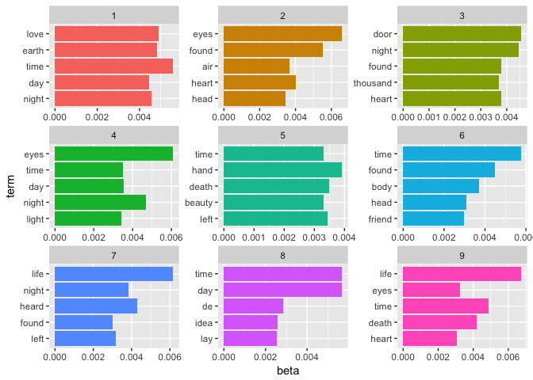

The results of 9 topics is almost the same with the first 9 topics in 12 topics. The next three topics in tutorial has some unique words like "moment" in topic 8; "moon","called" in topic 9; "air" in topic 10. I may check the difference latter.

In the above, we see that the first topic is characterized by words like "love", "earth", and "words" while the third topic includes the word "thousand", and the fifth topic the word "beauty". Note that the words "eyes" and "time" appear in many topics.

Besides estimating each topic as a mixture of words, LDA also models each document as a mixture of topics. We can examine the per-document-per-topic probabilities, called *gamma*, with the *matrix = "gamma"* argument to *tidy()*.

``` r
spooky_wrd_documents <- tidy(spooky_wrd_lda, matrix = "gamma")
spooky_wrd_documents
```

    ## # A tibble: 175,203 x 3
    ##    document topic gamma
    ##    <chr>    <int> <dbl>
    ##  1 id00001      1 0.111
    ##  2 id00002      1 0.112
    ##  3 id00003      1 0.110
    ##  4 id00004      1 0.111
    ##  5 id00005      1 0.110
    ##  6 id00006      1 0.112
    ##  7 id00007      1 0.110
    ##  8 id00009      1 0.111
    ##  9 id00010      1 0.110
    ## 10 id00012      1 0.110
    ## # ... with 175,193 more rows

Each of these values is an estimated proportion of words from that document that are generated from that topic. For example, the model estimates that only about 11.09% of the words in document 1 were generated from topic 1.

I looked through the documents, I found almost every documents id has similar rate generated from topic 1. Almost all of them are 10%. Seems like topic 1 is quite popular amont authors?? Or topic one suit for all author?? Other topics has similar situation...So I deceided to put author into the dataset instead of sentences.

``` r
new_documents_gamma<-merge(spooky_wrd_documents,spooky[,c(1,3)],by.x = "document",by.y = "id")
```

Now that we have these topic probabilities, we can see how well our unsupervised learning did at distinguishing authors. We’d expect that sentences would be found to be mostly (or entirely), generated from the corresponding topic.

we can visualize the per-author-per-topic probability for each.

``` r
# reorder titles in order of topic 1, topic 2, etc before plotting
new_documents_gamma %>%
  mutate(author = reorder(author, gamma * topic)) %>%
  ggplot(aes(factor(topic), gamma)) +
  geom_boxplot() +
  facet_wrap(~ author)
```

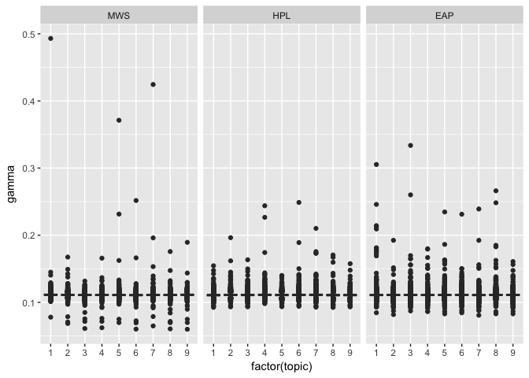

-   MWS showed a perference to topic 1,5,6,7.

-   HPL is a little hard to detect, topic 4,6,7 is more related.

-   EAP may have a wider interests, his sentences related to many topics like 1,3,5,6,7,8.

-   Topic 2,9 didn't showed a clear classification.

-   MWS has ore extrem values for those topics, EPA and HPL are more stable and easier to detect.

One step of the LDA algorithm is assigning each word in each document to a topic. The more words in a document are assigned to that topic, generally, the more weight (gamma) will go on that document-topic classification.

We may want to take the original document-word pairs and find which words in each document were assigned to which topic. This is the job of the augment() function, which also originated in the broom package as a way of tidying model output. While tidy() retrieves the statistical components of the model, augment() uses a model to add information to each observation in the original data.

``` r
assignments <- augment(spooky_wrd_lda, data = spooky_wrd_tm)
assignments
```

    ## # A tibble: 193,944 x 4
    ##    document term    count .topic
    ##    <chr>    <chr>   <dbl>  <dbl>
    ##  1 id00001  content  1.00   8.00
    ##  2 id00149  content  1.00   8.00
    ##  3 id02237  content  1.00   8.00
    ##  4 id02865  content  1.00   8.00
    ##  5 id03529  content  1.00   8.00
    ##  6 id03940  content  1.00   8.00
    ##  7 id04075  content  1.00   8.00
    ##  8 id04682  content  1.00   8.00
    ##  9 id04736  content  1.00   8.00
    ## 10 id04982  content  1.00   8.00
    ## # ... with 193,934 more rows

This returns a tidy data frame of book-term counts, but adds an extra column: .topic, with the topic each term was assigned to within each document. (Extra columns added by augment always start with ., to prevent overwriting existing columns). We still need to put author into the dataset.

``` r
assignments<-assignments%>%
  merge(spooky[,c(1,3)],by.x = "document",by.y = "id") 

confused<-assignments %>%
  group_by(.topic,author)%>%
  summarise(Count=n())
confused
```

    ## # A tibble: 27 x 3
    ## # Groups: .topic [?]
    ##    .topic author Count
    ##     <dbl> <fctr> <int>
    ##  1   1.00 EAP     7659
    ##  2   1.00 HPL     5917
    ##  3   1.00 MWS     8394
    ##  4   2.00 EAP     8002
    ##  5   2.00 HPL     7999
    ##  6   2.00 MWS     7413
    ##  7   3.00 EAP     8076
    ##  8   3.00 HPL     6913
    ##  9   3.00 MWS     6091
    ## 10   4.00 EAP     7111
    ## # ... with 17 more rows

``` r
p3<-ggplot(confused, aes(factor(.topic), Count,fill=author)) +
  geom_bar(stat='identity') +
  facet_wrap(~ author)+
  scale_fill_manual(values = c("#689420", "#FFCC66",fillColor))

p2<-ggplot(confused, aes(factor(.topic), Count,fill=author)) +
  geom_bar(stat='identity', position = 'dodge') + 
  scale_fill_manual(values = c("#689420", "#FFCC66",fillColor))

p1<-ggplot(confused, aes(factor(.topic), Count,fill=author)) +
  geom_bar(stat='identity') + 
  scale_fill_manual(values = c("#689420", "#FFCC66",fillColor))
layout <- matrix(c(1, 2,3), 3, 1, byrow = TRUE)
multiplot(p1, p2,p3, layout = layout)
```

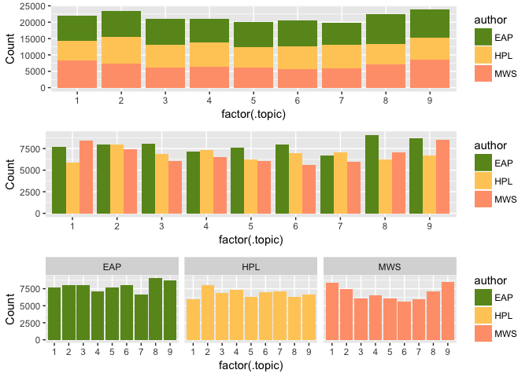

-   Overall, Topics 2 and 9 are common topics among all authors.

-   MWS have a higher percentage for topic 1 while EAP perfer topic 8.

-   The last graph shows topic 8 is EAP's most common topic, topic 2 is HPL's most common topic while MWS perfers topic 9 and 1.
